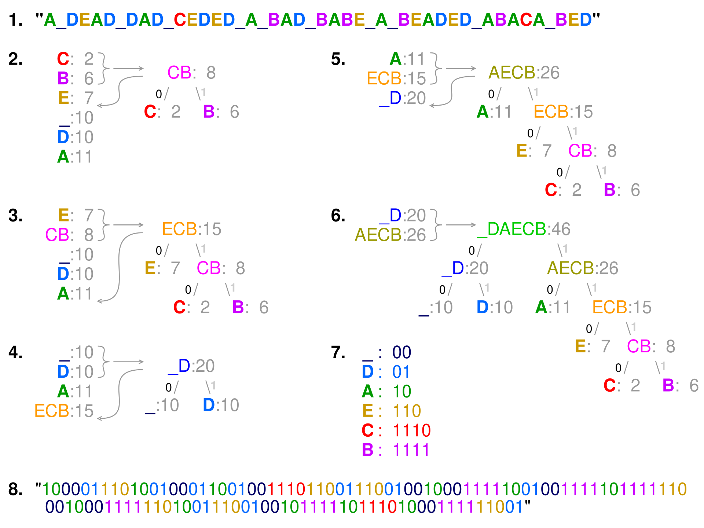

<!--more-->
## Huffman Coding

### construction of minimum weighted binary coding tree

To find a binary coding tree with minimum weighted path length from the root,
where the weight means the estimated frequency of occurrence.



**Shannon's Source Coding Theorem** states that for any lossless compression:
$$H \le L \lt H+1$$

```octave
octave:2> huffman_entropy
plaintext = A DEAD DAD CEDED A BAD BABE A BEADED ABACA BED
h_encoding = 1000011101001000110010011101100111001001000111110010011111011111100010001111110100111001001011111011101000111111001
p_len = 46
h_len = 115
bits_per_symbol = 2.5000
Entropy: 2.4441 bits
Huffman Encoding: [2.500000] bits/symbol.
Entropy of the plain text: [2.444137] bits.
```

$2.44137 \le 2.5 \lt 3.44137$

See [huffman_entropy](./huffman_entropy.m), [entropy_calc](./entropy_calc.m)

