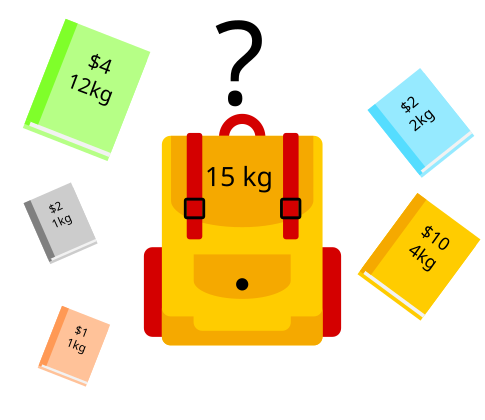
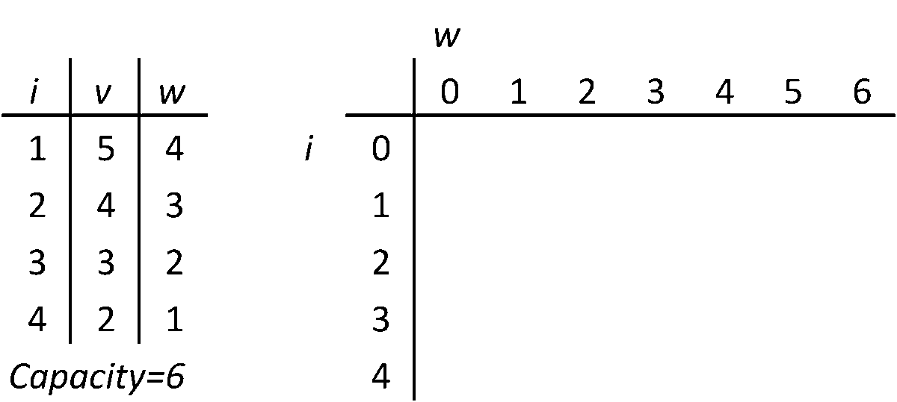

<!--more-->

<!--  -->
<!---->
## Fastest way

```java
public int knapsack01(int n, int W, int[] weights, int[] values) {
  int[] dp = new int[W+1];
  for (int i = 0; i < n; i++) {
    for (int j = W; j >= weights[i]; j--) {
      dp[j] = Math.max(dp[j], dp[j - weights[i]] + values[i]);
    }
  }
  return dp[W];
}
```


