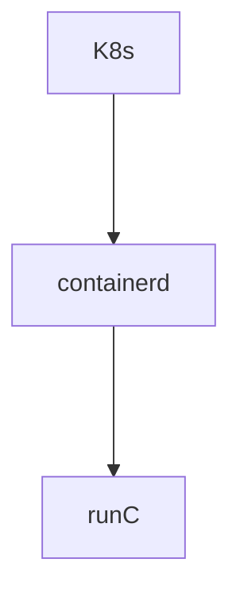
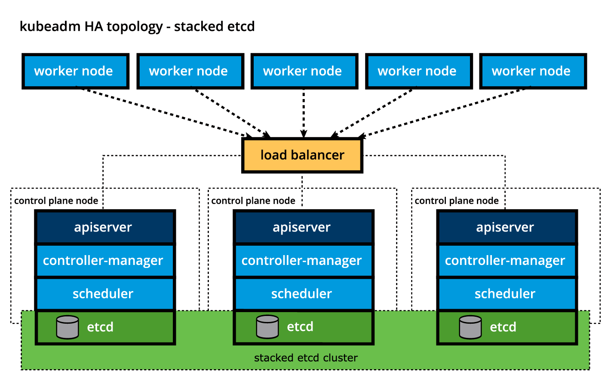
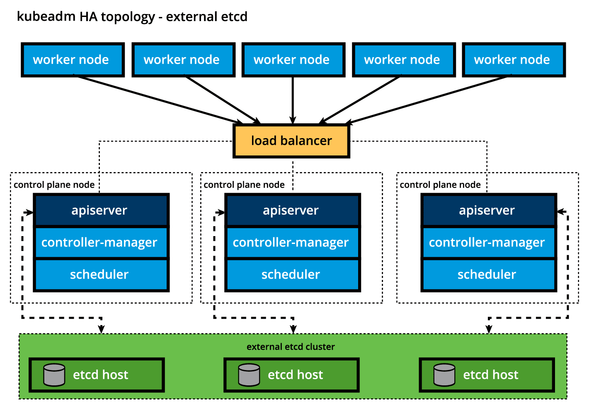
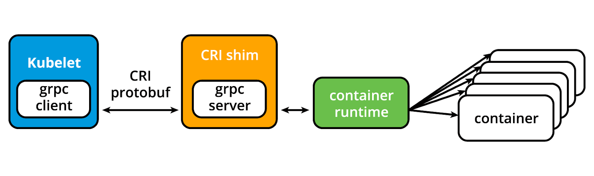
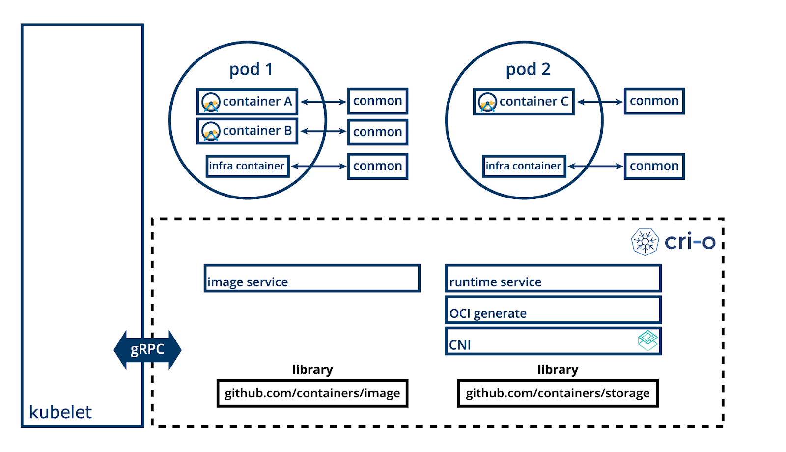
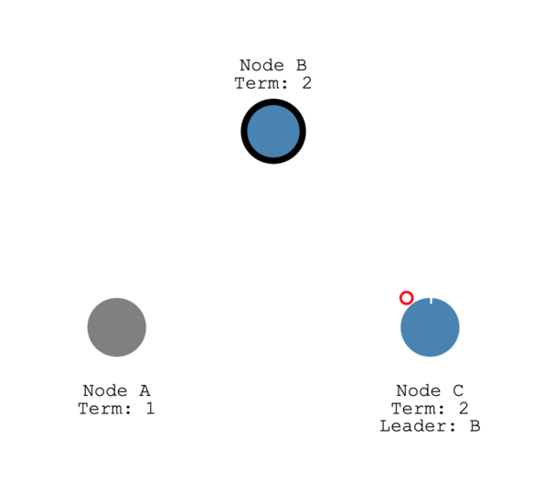
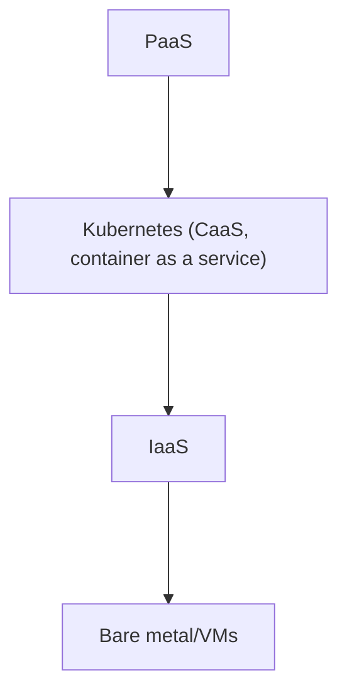

**Kubernetes** (k8s, Kate's) is an open-source system for automating deployment,
scaling, and management of containerized applications".

- Written in Go language.
- Inspired by Google Borg

## Microservices: Key Characteristics

**Microservices** are modular, independently deployable applications designed
to work together in a distributed system. They are characterized by:

### Core Attributes
- **Language & Dependencies**
  - Can be written in **various programming languages** (modern or legacy).
  - Isolated dependencies/libraries (often via containers).
- **Modularity**
  - Loosely coupled, with clear bounded contexts.
  - Owned by small teams ("you build it, you run it").

### Architectural Features
1. **Event-Driven**
   - Async communication (e.g., Kafka, RabbitMQ).
2. **Service-Oriented (SOA Evolution)**
   - More granular than traditional SOA.
3. **Scalability**
   - Independent horizontal scaling per service.
4. **Zero Downtime & Seamless Upgrades**
   - Rolling updates, blue-green deployments.
5. **Polyglot Flexibility**
   - Mix of languages/frameworks (e.g., Go, Python, Java).

### Deployment & Infrastructure
- **Cloud-Native**
  - Deployable on commodity hardware, VMs, or cloud (e.g., Kubernetes, serverless).
- **Resilience Patterns**
  - Circuit breakers, retries, timeouts.
- **Decentralized Data**
  - Each service manages its own database.

### Key Benefits
✔ **Faster releases** (independent deployment).
✔ **Fault isolation** (failure in one service ≠ system-wide outage).
✔ **Technology agility** (choose best tool per problem).

## Container Orchestration

### Architecture

Kubernetes clusters to be installed, with only a few commands, on top of
cloud Infrastructures-as-a-Service (IaaS).


### Goals

- Fault-tolerance
- On-demand scalability
- Optimal resource usage
- Auto-discovery to automatically discover and communicate with each other
- Accessibility from the outside world
- Seamless updates/rollbacks without any downtime.

### Deployment

Containers encapsulate microservices and their dependencies .

A container image bundles the application along with its runtime, libraries,
and dependencies, and it represents the source of a container deployed to
offer an isolated executable environment for the application.

#### **runC** (core runtime)

- An implementation of Open Container Initiative (OCI) specification
- Wrapped by **containerd** or **cri-o**, Container Runtime Interface (CRI) compliant
- Further interacted with K8s



## Cloud Native Computing Foundation (CNCF)

The CNCF is a cloud-native ecosystem built around the principles of
microservices, scalability, and distributed systems. It hosts a collection
of open-source projects — like Kubernetes, Prometheus, and Envoy — that run
on top of Linux and extend its capabilities into the cloud era.

It's hosted by Linux Foundation

Many graduated and incubating projects like:

- Kubernetes
- Argo
- etcd
- containerd
- cri-o
- Envoy
- Prometheus
- Flux

- gRPC
- KubeVirt

## K8s Cluster


- control plane nodes
- worker nodes

## Control plane node

- Running environment for control plane agents
- Agents with different roles responsible for cluster state management
- Ensure fault tolerance
  - control plane node replicas in cluster
  - configured in HA mode
  - only one active
  - control plane components stay in sync across replicas
- Persist cluster state in distributed K-V store
  - k-v store on control plane node (stacked topology)
    - replicas ensure resiliency
  - k-v store on dedicated host (external topology)
    - separately replicated for HA
- Components
  - API server
    - kube-apiserver
    - RESTful API
    - the only component to talk to K-V store (read / write cluster state)
    - highly configurable and customizable, secondary servers, routing based on
      custom defined rules
  - Scheduler
    - assign workload objects (e.g. pods encapsulating containers) to worker nodes
    - obtain resource usage data from K-V store via API server
    - obtain workload requirements from K-V store via API server
    - scheduling algorithm considering
      - data locality
      - affinity / anti-affinity
      - taints
      - toleration
      - cluster topology
    - filter nodes
  - Controller Manager
    - regulate the state of the Kubernetes cluster
    - kube-control-manger
    - cloud-control-manager
      - talk to IaaS when nodes become unavailable
  - Key-Value Store
    - **etcd**
      - written in Go
      - storing the cluster state
      - store configuration details such as subnets, ConfigMaps, Secrets, etc.

      - Stacked etcd Topology
        

      - External etcd Topology
        
  - Container Runtime
  - Node Agent (Kubelet)
  - Proxy (Kube-proxy)
  - Dashboards, monitor, logger

## Worker node

- Pod: the smallest scheduling (start/stop/reschedule) work unit, encapsulating
  a collection of containers
  - Network traffic between client users and containerized applications in
    Pods are handle by worker node

- Components:
  - Container runtime
  - Node Agent - kubelet
  - Proxy - kube-proxy
  - Add-ons for DNS, dashboards, cluster-level monitoring and logging, and
    device plugins

Kubernetes is described as "container orchestration engine", but lacks the
ability of running container directly. It requires **container runtime** on
the node where a Pod and its containers are to be scheduled.

- Container runtime supported by Kubernetes:
  - containerd
  - CRI-O
  - Docker Engine (use containerd)

- Node agent - Kubelet
  - running on every node (Control plane and Worker)
  - speaks CRI (plugin based architecture) to container runtime
    - CRI consists of protocol buffers, gRPC API, libraries and other tools
    - CRI provides two services: ImageService and RuntimeService
    - kubelet acts as gRPC client
  - CRI shim (i.e. adapter/service provider/middleware):
    - cri-containerd
    - cri-dockerd
    - shim acts as gRPC server
  - Modern container runtime are mostly CRI compatible no need of separate shims





- Proxy - Kube-proxy
  - network agent runs on each node
  - responsible for TCP, UDP, and SCTP (Layer 4) stream forwarding or random
    forwarding across a set of Pod backends
  - work with iptables of the node

### Networking Challenges

- Container-to-Container communication inside Pods
  - sharing the same network namespace: underlying host system kernel's
    virtualisation feature, meaning sharing same IP address, network
    interface, port space
    - via localhost: like processes in same VM attached to different ports
    - via shared volume: inter-container communication, write to / read from a
      shared volume
- Pod-to-Pod communication on the same node and across cluster nodes
  - treats Pods as VMs on a network, each Pod is assigned an unique
    IP (IP-per-Pod) by CNI plugin
- Service-to-Pod communication within the same namespace and across cluster
  namespaces
  - via kube-proxy: exposing services to external world over a virtual IP
    address and a dedicated port
- External-to-Service communication for clients to access applications in a
  cluster

### Fault-tolerance

- [The Raft Consensus Algorithm](https://raft.github.io/)
  - An algorithm to address "Consensus" problem, multiple servers agree on
  values, which is a fundamental problem in fault-tolerant distributed system.

- [Raft Visualization Explanation](https://thesecretlivesofdata.com/raft/)

  - Node type: Leader, Candidate, Follower
  - Leader Election, majority nodes agree
    - two timeout settings
      - election timeout: a follower waits until becoming a candidate
        - randomized to be 150ms~300ms
        - after the timeout a follower becomes a candidate and starts a new
          election term, votes for itself, sends out Request vote messages to
          other nodes
        - if a receiving node hasn't voted in this term, vote for the candidate
          and resets its election timeout
        - once the candidate has a majority of votes, it becomes leader
      - heartbeat timeout: the intervals in which Append Entries messages are
        sent by the leader to its followers
        - followers respond to each Append Entries message
        - this election term will continue until a follower stops receiving
          heartbeats and become a candidate
    - only one leader can be elected at a time (by majority votes)
    - vote may split when multiple nodes start an election for the same term,
      the term might be passed then a new election starts

    Elected and Keep sending heartbeat

    

    Re-election when no heartbeat

    

  - Log Replication, all changes go through the Leader following this process:
    - a client send a change to the leader
    - the leader adds the change as an entry to its log (uncommitted)
    - the change is sent to the followers on the next heartbeat (replication)
    - the leader node wait until majority nodes have written the entry (ack)
    - the entry is now committed in the leader node, state change has been made
    - the leader notify the followers that the entry is committed
    - the cluster has come to consensus about the system state
    - the leader respond to the client the state change

  - Network partition, multiple leaders in different terms
    - when network issue is fixed and the partition disappears, the minority
      leader steps down and all its uncommitted log entries are cleared


## Kubernetes Configuration



### Installation Types

- all-in-one single-node (learning, development and testing)
- single control plane node and multiple worker node
- single control plane node with single etcd node (external) and multi-worker
- multiple control plane node (HA mode, with stacked etcd) and multiple worker node
- multiple control plane node, multiple etcd (external) and multiple worker

### Infrastructure

- IaaS choice: bare mental, public cloud, private or hybrid cloud
- OS choice: Linux (Red Hat-based, Debian-based, or Windows)
- CNI solution choice

### Local Learning Cluster Installation Tools

- Minikube
- Docker Desktop
- MicroK8s
- K3S (originally from Rancher, CNCF project)

### Production Ready Cluster Installation Tools

- kubeadm
- kubespray
- kops

### Kubernetes Certified Service Provider (KCSP)

- Popular Hosted Solutions
  - ACK
  - EKS
  - AKS
  - DOKS
  - GKE
  - ICKS
  - OKE
  - RHO
  - VTKG

### Kubernetes on Windows

Only supported as worker node to deploy Windows container in the cluster

## Local K8s Cluster Installation

### Preparation

#### Type-2 Hypervisor or Container Runtime

- Docker

#### Minikube and kubectl

```sh
minikube [start|stop] [-p profile]
minikube profile list
minikube dashboard
kubectl get pods -A
```

##### Add completion to Zsh

```sh
omz plugin list | grep -E "kubectl|minikube"
```

In `~/.zshrc`, 

```
plugins=(
  git
  kubectl
  minikube
)
```


## References
- [Introduction to Kubernetes](https://www.edx.org/learn/kubernetes/the-linux-foundation-introduction-to-kubernetes)
