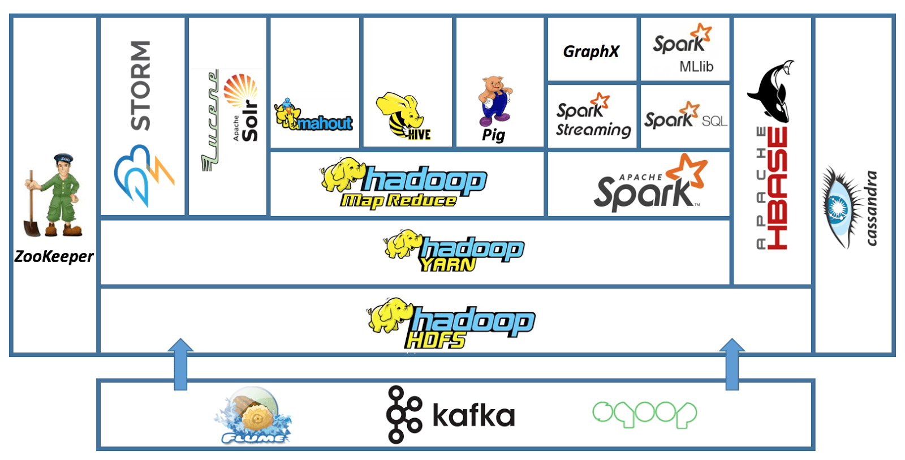
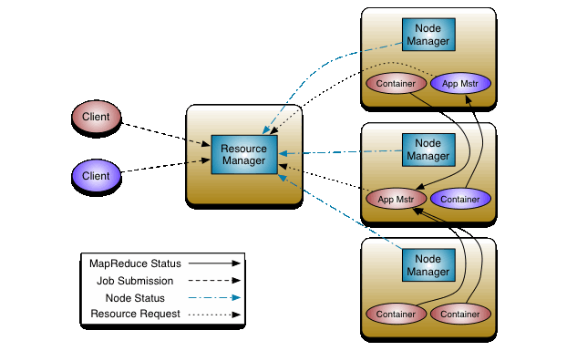
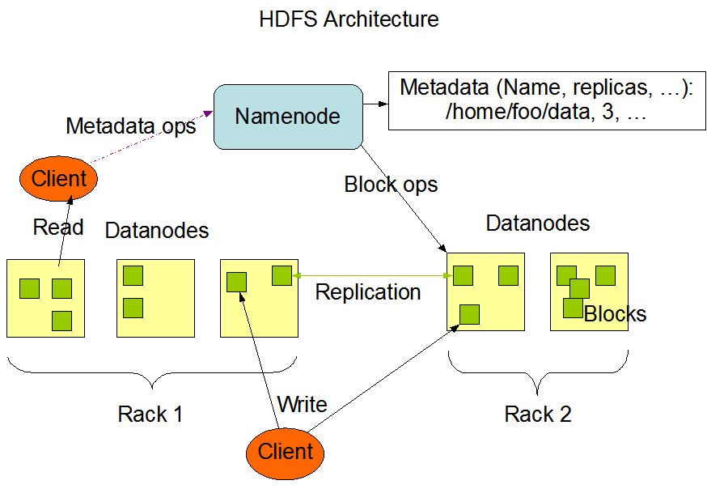

<!--more-->
## Hadoop

### Hadoop Eco System

### Hadoop Cluster Components

#### Master Node

- higher quality hardware
- NameNode, Secondary NameNode, JobTracker w/ each running on a separate machine
- responsible for storing data in HDFS and overseeing key operations, such as
  parallel computations on the data using MapReduce

#### Worker Node

- virtual machines running on commodity hardware
- DataNode and TaskTracker running on each worker node
- responsible for the actual work of storing and processing the jobs as
  directed by the master nodes

#### Edge Node (a.k.a. Gateway Node or Client Node)

- responsible for loading the data into the cluster, submitting MapReduce jobs
  (how data needs to be processed) and then fetch the results.

#### Summary

- Master Nodes: NameNode, ResourceManager (control services).
- Worker Nodes: DataNode, NodeManager (storage & compute).
- Edge Nodes: Client tools, job submission, data ingestion.

### Hadoop Cluster Architecture

#### YARN (ResourceManager and NodeManager)

The ResourceManager is the "brain" of YARN, ensuring efficient and fair
resource sharing across the Hadoop cluster. It runs on the Master Node and
works with NodeManagers (on Workers) and ApplicationMasters (per-job managers)
to execute distributed applications.

Analogy:

- RM = Air Traffic Control
  Manages all flights (jobs) in the cluster (airspace).
- NM = Airport Ground Control
  Handles takeoffs/landings (containers) on a single node (airport).
- Containers = Runways
  Allocated to flights (tasks) for a limited time.

- Global Resource Allocation
  - Manages and allocates cluster resources (CPU, memory) to applications
    (e.g., MapReduce, Spark, Hive) running on Worker Nodes.
  - Ensures fair sharing of resources among different users or queues (using
    schedulers like Fair Scheduler or Capacity Scheduler).
- Application Life-cycle Management
  - Accept job submissions from clients (via the Edge Node)
  - Start Application Master (AM) for each application (e.g., a MapReduce or
    Spark job)
  - Monitor the AM and restarts it if it fails
- Node Management
  - Communicates with Node Managers (running on Worker Nodes) to track
    resource availability.
  - Handle heartbeats from NMs to detect node failures.
- Security & Scheduling
  - Enforces access controls (e.g., via Kerberos or ACLs).
  - Uses a plug-in scheduler (Fair/Capacity/DRF) to assign resources based on
    policies. (policy provider)

#### HDFS (NameNode and DataNodes)

An analogy is to consider NameNode as inode (Unix/Linux File System),
stores and manage file metadata (file name, permissions, block locations) vs
inode (permissions, size, pointers to data blocks); DataNodes as data
blocks that stores actual file data and tracked by NameNode (inode); Data
replication as RAID.

#### Edge Nodes

##### Security & Access Control

- As controlled entry point to enforce authentication (Kerberos, LDAP) and
  authorization policies.
- Channeling all user access through the entry points, limiting access to
  master / worker nodes, enforce strict security policies.

##### Job Submission

- submit Hadoop jobs (MapReduce, Spark, Hive, etc.)
- tools: hadoop, yarn, spark-submit

##### Data Ingestion & Export

- import/export data into HDFS or other storage systems (sqoop, flume, kafka)
- connected to external data sources (databases, APIs, etc.)

##### Development & Administration

- Ambari, Cloudera Manager agents
- Hosts BI tools (like Tableau, Power BI) that query Hadoop data.

### Hadoop Cluster Size

A set of metrics that defines storage and compute capabilities to run Hadoop
workloads:

- Number of nodes: Master nodes, Worker nodes, Edge nodes (Client / Gateway)
- Configuration of each type node: number of cores per node, RAM and Disk Volume

