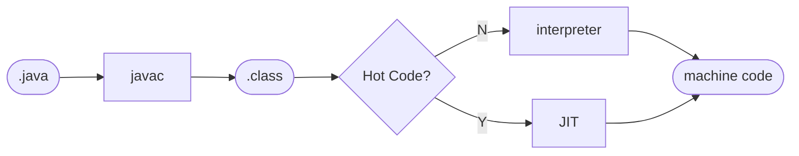
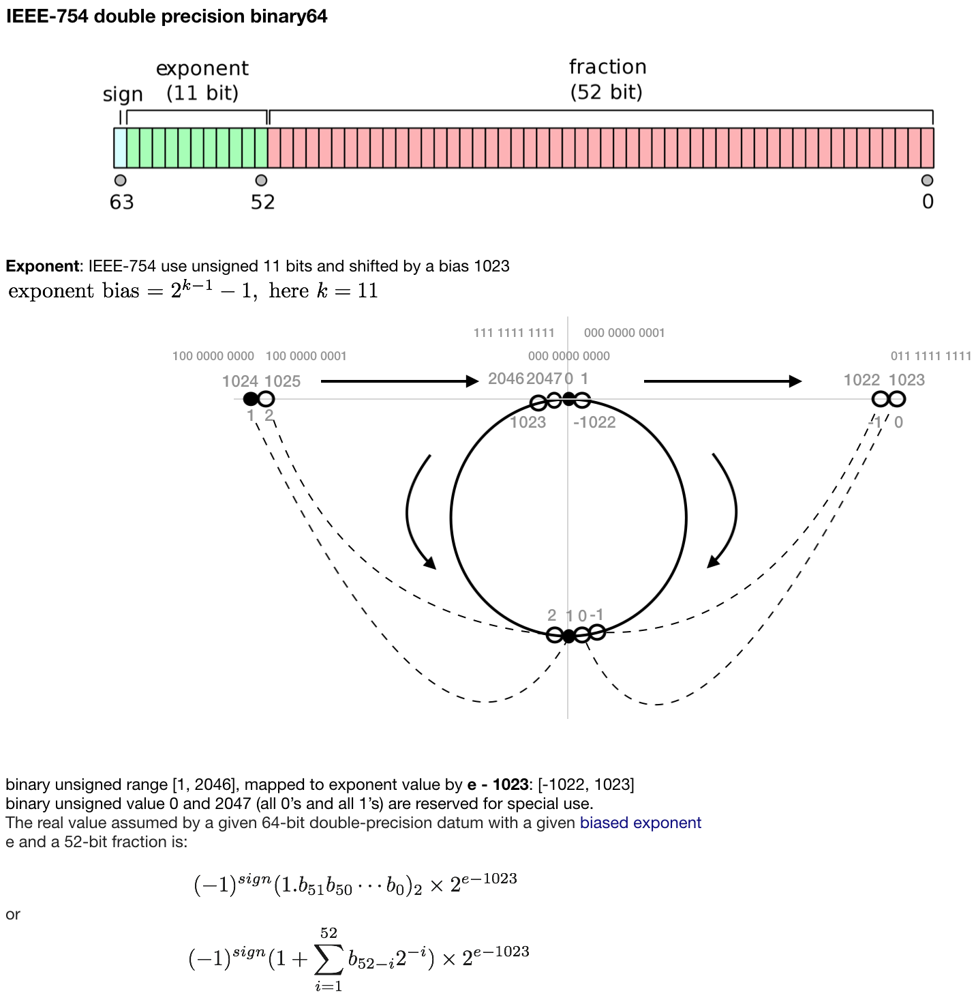
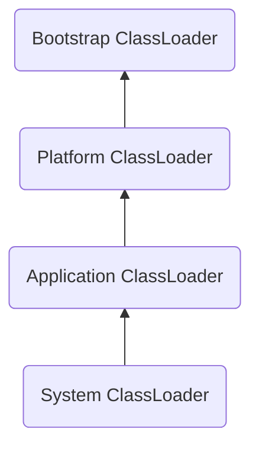

# Basics

## JDK

### [JEP 261: Module System](https://openjdk.org/jeps/261)
- [JEP 282: jlink: The Java Linker](https://openjdk.org/jeps/282): assemble
  and optimize a set of modules and their dependencies into a custom run-time
  image defined in [JEP 220: Modular Run-Time Images](https://openjdk.org/jeps/220)
- Java application doesn't have to run in a full JRE.
- Very important for modern application architecture: virtualization,
  containerization, microservices, and cloud-native development (对现代应用
  程序架构虚拟化，容器化，微服务，云原生开发非常重要)
- Since Java 9, 2017

### Bytecode
- Compile once, run everywhere. JVM oriented, not Platform oriented.




### Java Native Interface (JNI)

JNI allows Java code to call (and be called by) native applications and
libraries written in languages like C or C++. The keyword is `native`

  - Loading, declaration and calling

```java
// MyClass.java
public class MyClass {
  static {
    System.loadLibrary("mylib"); // Load the shared library libmylib.so on Linux
                                 // libmylib.dylib on macOS
                                 // libmylib.dll on Windows
  }

  public native String myNativeMethod(String msg); // Declaration of native method

  public static void main(String[] args) { // java main args no executable name
    if (args.length > 0) {
      String res = new MyClass().myNativeMethod(args[0]); // Calls C function via JNI
      System.out.println("Received from native: <" + res + ">");
    }
  }
}
```

  - Implementation
    - Compile Java class and generate C header
```sh
> javac -h . MyClass.java
```

```c
// MyClass.h
/* DO NOT EDIT THIS FILE - it is machine generated */
#include <jni.h>
/* Header for class MyClass */

#ifndef _Included_MyClass
#define _Included_MyClass
#ifdef __cplusplus
extern "C" {
#endif
/*
 * Class:     MyClass
 * Method:    myNativeMethod
 * Signature: (Ljava/lang/String;)Ljava/lang/String;
 */
JNIEXPORT jstring JNICALL Java_MyClass_myNativeMethod
  (JNIEnv *, jobject, jstring);

#ifdef __cplusplus
}
#endif
#endif
```

  - Write C implementation

```c
# mycode.c
#include <stdio.h>
#include "MyClass.h"

JNIEXPORT jstring JNICALL Java_MyClass_myNativeMethod
  (JNIEnv *env, jobject obj, jstring jstr) {
  const char *s = (*env)->GetStringUTFChars(env, jstr, NULL);
  printf("Receive from Java: <%s>\n", s);
  (*env)->ReleaseStringUTFChars(env, jstr, s); // Always release it!
  return (*env)->NewStringUTF(env,  "I'm fine. And you?");
}
```
  - Compile C code and generate library

```sh
> gcc $(CC_FLAGS.$(PLATFORM)) -I"$$JAVA_HOME/include" -I"$$JAVA_HOME/include/$(PLATFORM)" -o libmylib.$(LIB_EXT.$(PLATFORM)) mycode.c

# NOTE:
# PLATFORM: linux, darwin
# CC_FLAGS.linux: -shared -fPIC
# CC_FLAGS.darwin: -dynamiclib
# LIB_EXT.linux: so
# LIB_EXT.darwin: dylib
```

  - Check Library binary format
    - .dylib: Mach-O (darwin, i.e. macOS)
    - .so: ELF (linux)
```sh
> file libmylib.dylib
libmylib.dylib: Mach-O 64-bit dynamically linked shared library x86_64
> file libmylib.so
libmylib.so: ELF 64-bit LSB shared object, x86-64, version 1 (SYSV), dynamically linked, ...
```

  - Run the Java code

```sh
> java -Djava.library.path=. MyClass "How are you?"
Received from native: <I'm fine. And you?>
Receive from Java: <How are you?>
```

## [Bitwise operations](./bitwise.md)

## Data types

### 8 primitive types
```java
byte short int long char float double boolean
```

Only `char` is unsigned, default value `u0000`

- `byte`: 8-bit $\left[-2^7, 2^7-1\right]$, i.e. $\left[-128, 127\right]$
- `char`: 16-bit $[0, 2^{16} - 1]$, i.e. $\left[0, 65535\right]$
- `short`: 16-bit $\left[-2^{15}, 2^{15}-1\right]$, i.e. $\left[-32768,
- `int`: 32-bit
- `float`: 32-bit
- `long`: 64-bit
- `double`: 64-bit
- `boolean`: 1-bit

### 8 wrapper classes

```java
Byte Short Integer Long Character Float Double Boolean
```

#### Boxing and unboxing

```java
Integer i = 5;      // auto-boxing:     Integer i = Integer.valueOf(5);
int j = i;          // auto-unboxing:   int j = i.intValue();
```

- Avoid unnecessary large amount of auto-boxing and auto-unboxing

```java
private static long sum() {
    Long sum = 0L;  // Use long instead of Long (7.7s vs 0.9s)
    for (long i = 0; i <= Integer.MAX_VALUE; i++)
        sum += i;
    return sum;
}

[INFO] [stdout] Test test_primitive_type_performance()  :    0 s 872 ms 790 µs 915 ns
[INFO] [stdout] Test test_auto_boxing_performance()     :    7 s 708 ms 189 µs 622 ns
```

#### Cache mechanism

```java
public final class Integer extends Number
    private static final class IntegerCache
```

Cache size

Float and Double have no cache.

### Double/Float precision

Even though the range of double is huge (≈ ±1.8×10³⁰⁸), only a finite subset
of decimal numbers can be represented exactly. Because:

- Limited precision: Only 53 bits for the significand (a.k.a mantissa)
- Binary system: Decimal fractions often can't be exactly represented in binary
- Always compare doubles with **tolerance**, not `==`

```java
    assertNotEquals(0.3, 0.1 + 0.2);
    assertEquals(0.30000000000000004, 0.1 + 0.2);
```

- Use `BigDecimal` in Java for exact decimal math
  - base 10  - arbitrary precision
  - use string argument

```java
new BigDecimal("0.1"); // YES
new BigDecimal(0.1);   // NO

BigDecimal a = new BigDecimal("0.1");
BigDecimal b = new BigDecimal("0.2");
assertEquals(new BigDecimal("0.3"), a.add(b));

BigDecimal c = new BigDecimal(0.1);
BigDecimal d = new BigDecimal(0.2);
assertNotEquals(new BigDecimal(0.3), c.add(d));
```



### Boolean Logical Operations

#### Operations
- AND:  (`&`)
- OR :  (`|`)
- XOR:  (`^`)
- NOT:  (`!`)

#### Examples

- $A \oplus true \Leftrightarrow \neg{A}$
- Or in Java,
```java
// t is a boolean
(t ^ true) == !t
```

### Java Memory Areas (simplified JVM model)


|       Heap             |
|------------------------|
|  new objects         |
| instance fields     |

| Method Area (MetaSpace) |
|-------------------------|
| Class metadata       |
|   Static fields        |
| Instance method       |
|   Static methods       |
|   Constant pool        |

|      Stack (per thread) |
|-------------------------|
| Method calls         |
|   Local variables      |
|   Operand stack        |


|   PC Register   |
|-----------------|
|Program counter (per thread)|


|   Native Method Stack   |
|-------------------------|
| For native (JNI) methods|


## Clone an object

### `==` and `equals()`

- `==`
  - primitive data type: compare value
  - Object type: compare reference value
    - different objects make it false

- `equals()` only for objects
  - If no overriding, a user class defaults to Object's equals(), which
    is just reference comparison like `==`
  - 8 wrapper classes like Integer, String, Char, etc. have their own
    overridden equals() to compare internal value.

```java
String s1 = new String("abc");
String s2 = new String("abc");
System.out.println(s1 == s2); // ❌ false — different objects in memory
System.out.println(s1.equals(s2)); // ✅ true — same content
```

  - `equals()` and `hashCode()` overriding

Always override `hashCode()` when override `equals()`, esp. when the class
would be used in `HashSet`, `Hashtable`, etc.

- Two objects `equals()`, their `hashCode()` should also be equal to each
  other.
- Two objects have the same `hashCode()`, don't have to `equals()` (due
  to hash collision).
- Two objects have different `hashCode()`, they must be different.
- Collections like `HashSet`, `HashMap`:
  - `hashCode()` is only used to narrow down to a bucket
  - `equals()` is used to identify the exact key
  - If `equals()` is not overridden properly, two "logically equal" keys
    may be treated as different → leading to duplicates

```java
class E {
  private String s;
  private int[] a;
  @Override
  public int hashCode() {
    return Objects.hash(s, Arrays.hashCode(a));
  }

  @Override
  public boolean equals(Object o) { // Override Object's equals(Object)
    if (this == o) return true;
    if (!(o instanceof E)) return false;
    E other = (E) o;
    return Objects.equals(s, other.s) && Arrays.equals(this.a, other.a);
  }
}
```

- Collection comparison:
  - Arrays.equals(a1, a2)
    - element-wise comparison:
      - primitive type: `==`
      - Object type: `equals()`
        - `[]` array is also of Object type, if a1, a2 are nested arrays, i.e.
          the elements of a1, a2 are also `[]`s, then use `a1[0].equals(a2[0])`
          or `Objects.equals(a1[0], a2[0])` (since 1.7). Since `[]` doesn't
          override `Object.equals()`, then `Objects.equals(a1[0], a2[0])` is
          equivalent to reference comparison `a1[0] == a2[0]`.
  - Arrays.deepEquals(a1, a2)
    - recursive element-wise comparison, if element is `[]`, deepen down
      element-wise comparison
  - JUnit5 assertions
    - assertArrayEquals(a1, a2):
      - primitive type array: assertTrue(Arrays.equals(a1, a2))
      - Object type array: assertTrue(Arrays.deepEquals(a1, a1))

### Cloneable

To make a class `Cloneable`, it just indicates that your class allows
field-by-field copying via Object.clone(). It doesn't enforce any equality
or hashing behavior.

```java
class E implements Cloneable {
  private String s;
  private int[] a;
  @Override
  public E clone() {
    try {
      E e = (E) super.clone();
      e.setS(s);                        // no need to copy immutable String
      e.setA(a == null ? null :a.clone());  // JVM built-in implementation
                                            // of [] (array) (Cloneable)
      return e;
    } catch (CloneNotSupportedException cnse) {
      throw new AssertionError();
    }
  }
}
```

## Serialize an object

At minimum, to implement `Serializable`, set a `serialVersionUID` manually.

```java
public class MyData implements Serializable {
    private static final long serialVersionUID = 1L;

    private String name;
    private int age;
}
```

Bump it (2L, 3L, etc.) only if serialized format actually changes and you
want to break compatibility.

You must not have any non-serializable fields unless they're marked
**transient**. Arrays of primitives and most Java standard classes (e.g.
String, Integer, List) are already serializable.

`static` fields and methods are part of class definition, stored in .class
file (loaded by the JVM into method area of memory). They are excluded from
serialization.

How to solve losing runtime values of static fields when the JVM restarts?
- For true persistence: Treat static fields like application configuration
(save to disk/database).
- For temporary state: Accept that static fields reset when the JVM restarts.

```java
class User implements Serializable {
    // `serialver -classpath target/test-classes korhal.io.SerializableTest`
    // private static long serialVersionUID = -6543866435090341062L;
    private static long serialVersionUID = 1L;

    private String username;
    private transient String password; // 🚫 not serialized
    public static int group;           // 🚫 not serialized

    ...
    // optional
    private void writeObject(java.io.ObjectOutputStream out)
        throws IOException;
    private void readObject(java.io.ObjectInputStream in)
        throws IOException, ClassNotFoundException;
    private void readObjectNoData()
        throws ObjectStreamException;
}
```

Customize for fine control.

```java
private void writeObject(ObjectOutputStream out) throws IOException
private void readObject(ObjectInputStream in) throws IOException, ClassNotFoundException

```

Although they are defined as **private**, they are invoked reflectively by
the JVM's ObjectOutputStream and ObjectInputStream.

When user calls

```java
ObjectOutputStream oos = new ObjectOutputStream(...);
oos.writeObject(obj); // obj is an instance of your class

```

JVM does

```java
Method m = obj.getDeclaredMethod('writeObject', ObjectOutputStream.class);
// if writeObject doesn't exists, NoSuchMethodException will be thrown
m.setAccessible(true);
m.invoke(obj, oos);
```

Consider efficiency and security, JDK built-in serialization implementation is
rarely used. Common 3rd party libraries: Hessian、Kryo、Protobuf、ProtoStuff

Serialization and marshalling (likewise, deserialization and unmarshalling)
are closely related concepts and are sometimes used interchangeably. However,
marshalling typically emphasizes RPC (Remote Procedure Call) contexts, where
metadata (e.g., endpoint references, data schemas, or versioning) is bundled
with the object data for cross-system communication. Serialization, on the
other hand, generally focuses on converting objects to a storable/transmittable
format (e.g., binary, JSON) without necessarily including additional
protocol-level details. Serialization/marshalling (deserialization /
unmarshalling) are close to each other and sometimes are interchangeable.
But marshalling emphasize more on RPC context where metadata, description
information are involved alongside object data.

## Java I/O Stream

Java provides two main types of I/O streams based on the kind of data they handle:

### Byte Streams
Used for handling **binary data** (e.g., images, audio, files).

- `InputStream` — base class for reading bytes.
- `OutputStream` — base class for writing bytes.

### Character Streams
Used for handling **text data** (character encoding aware).

- `Reader` — base class for reading characters.
- `Writer` — base class for writing characters.

## Syntactic Sugar

It is the Java compiler, not the JVM, that understands and transforms
syntactic sugar. Internally, the compiler use functions `desugar()`
to translate high-level syntax into forms that can be converted into JVM
bytecode.

- `com.sun.tools.javac.main.JavaCompiler.desugar()`
  - `com.sun.tools.javac.main.JavaCompiler.compile()`

The most commonly used syntactic sugars in Java include generics,
autoboxing/unboxing, varargs, enums, inner classes, enhanced for-loops,
try-with-resources, and lambda expressions.

## Generic

### Wildcard Types

- unbounded wildcard
- upper-bounded wildcard
- lower-bounded wildcard

```java
public void get(List<?> l) {}               // match any type
public void get(List<? extends A> l) {}     // match A and its subtypes
public void get(List<? super A> l) {}       // match A and its supertypes

```

## Packaging (Encapsulation/Modularity)

## Inheritance

### Interface

- Interface can have default implemented methods.
- Interface can have `public static final` fields.
  - `static` fields are class / interface level
  - `final` fields are constant
  - Fields of interface are initialized when the interface is loaded in
    JVM
  - No need to explicitly declare the fields as `public static final` for
    compiler will add these modifiers automatically.
  - interface cannot have non-static fields
- Interface can have private members (since Java 9)
- Interface can **`extends`** multiple interfaces and inherit all the default
  methods and fields from them.

```java
// Super Interface 1 with a default method and a field
interface SuperInterface1 {
    // Initialized when SuperInterface1 is loaded into the JVM
    long START_TIME_MILLIS = System.currentTimeMillis();; // Implicitly public static final

    default void defaultMethod1() {
        System.out.println("Default method from SuperInterface1");
    }
}

// Super Interface 2 with a default method and another field
interface SuperInterface2 {
    String MESSAGE = "Hello from SuperInterface2"; // Implicitly public static final

    default void defaultMethod2() {
        System.out.println("Default method from SuperInterface2");
    }
}

// Derived Interface extending both SuperInterface1 and SuperInterface2
interface DerivedInterface extends SuperInterface1, SuperInterface2 {
    void abstractMethod(); // An abstract method specific to DerivedInterface
}

// A class implementing the DerivedInterface
class MyClass implements DerivedInterface {
    @Override
    public void abstractMethod() {
        System.out.println("Implementing abstractMethod in MyClass");
    }
    // No need to implement defaultMethod1 or defaultMethod2, they are inherited
}

public class InterfaceInheritanceDemo {
    public static void main(String[] args) {
        MyClass obj = new MyClass();

        // Calling inherited default methods
        obj.defaultMethod1(); // Inherited from SuperInterface1
        obj.defaultMethod2(); // Inherited from SuperInterface2

        // Calling its own abstract method implementation
        obj.abstractMethod();

        // Accessing inherited fields (constants)
        System.out.println("Constant from SuperInterface1: " + DerivedInterface.START_TIME_MILLIS);
        System.out.println("Constant from SuperInterface2: " + DerivedInterface.MESSAGE);
    }
}
```

## Polymorphism

### Overriding (Dynamic polymorphism, determined at runtime)

    overriding = riding over, superseding, same signature in different class

A subclass (or derived class) provides its own specific implementation for a
method that is already defined in its superclass (or base class). The method
signature (name, number and types of parameters, and return type) must be the
same as the method in the superclass.

Allow objects of different classes to be treated as objects of a common type,
while still executing the specific behavior of the subclass.

- Java
  - all non-static methods are **`virtual`** by default, allowing all of them
    to be overridden by default.
  - visibility of an overriding method in sub-class must not be less than that
    of super-class
  - `@Override` is not mandatory for a overriding method, but strong
    suggested for telling compiler to check signature.

- C++
  - only function with **`virtual`** modifier can be overridden
  - when a method is virtual, the actual function called is determined at
    runtime based on the object's dynamic type (not the reference / pointer
    type).

```cpp
class Base {
public:
    virtual void foo() { cout << "Base::foo" << endl; }
};

class Derived : public Base {
public:
    void foo() override { cout << "Derived::foo" << endl; } // Overrides Base::foo
};

Base* obj = new Derived();
obj->foo(); // Calls Derived::foo (polymorphism)
```

  - when a method is not virtual, the function is statically bound at compile
    time based on the reference / pointer type (no polymorphism).

```cpp
class Base {
public:
    void bar() { cout << "Base::bar" << endl; }
};

class Derived : public Base {
public:
    void bar() { cout << "Derived::bar" << endl; } // Shadows Base::bar
};

Base* obj = new Derived();
obj->bar(); // Calls Base::bar (no polymorphism)
```

  - pure virtual function, a virtual function with assignment of 0, makes the
    class abstract, allowing no instantiation (`virtual void func() = 0`).
    The derived class must override all the pure virtual functions to become
    concrete class.


### Overloading (static polymorphism, determined at compile time)

    overloading = loading too much, different signatures in same class

By different signature in same class, it means methods of same name with
different number or types of parameters. Here, return type is not part of
signature, because, from compiler's perspective, if two methods of same name,
with same parameter signature, it cannot determine which one to bind for an
object's invocation.

### Some Notes

#### `private`

Private methods of a superclass (or interface) cannot be inherited, overridden,
or implemented.

#### `static`

Static fields belong only to its class.

Static methods of a superclass (or interface) are not subject to polymorphic
dispatch, meaning they cannot be overridden. They are also not inherited in
the traditional sense, nor can they be implemented by derived classes or
interfaces.

- static method in interface must has a body (be implemented).
- subclass **can** call superclass's static method through its subclass name,
  but **STRONGLY DISCOURAGED**
- subinterface cannot call superinterface's static method through its
  subinterface name

## Nested Class

- Inner class can extends outer class
- static members (include inner class) have no access to non-static members
- static inner class extends outer class have access to non-static outer
  members (public, protected) due to inheritance.
  - static inner class extends outer class have no access to private
    non-static outer members

```java
class Outer {
  public int m1(int i) {
    return i + 1;
  }

  private int m2(int i) {
    return i + 2;
  }

  protected int m3(int i) {
    return i + 3;
  }

  private static int m4(int i) {
    return i + 4;
  }

  private static class PrivateStaticInner extends Outer {
    public int n1(int i) {
      return m1(i) + 100;     // the implicit caller **this** is instance of
                              // inner, not an instance of outer. m1() is
                              // visible due to inheritance.
    }

    private int n2(int i) {
      // return m2(i) + 100;  // compilation error: static inner also as sub
                              // outer cannot access to outer private
                              // non-static for invisibility from both
                              // inheritance's and static/non-static's perspective.
      return m3(i) + 100;     // OK: sub outer inherits outer public
    }

    private int n4(int i) {
      return m4(i) + 100;     // OK: static inner have access private static
                              // outer member
    }

    protected int n3(int i) {
      return m3(i) + 100;
    }
  }
}
```


```java
class Outer$PrivateStaticInner extends Outer {
   private Outer$PrivateStaticInner() {
   }

   public int n1(int i) {
      return this.m1(i) + 100;          // call its own inheritance
   }

   private int n2(int i) {
      return this.m3(i) + 100;          // call its own inheritance
   }

   private int n4(int i) {
      return Outer.m4(i) + 100;         // visible due to outer static
   }

   protected int n3(int i) {
      return this.m3(i) + 100;          // call its own inheritance
   }
}
```
## Reflection

### TypeName.class

In Java, TypeName.class refers to the **Class object** that represents the type
TypeName. It is part of Java’s reflection system.

For each type TypeName, there is exactly one Class<TypeName> object.

### 5 Ways to Get Class<TypeName> object

```java
    // 5 ways to get Class object
    Super sup = new Super();
    Sub sub = new Sub();

    // a) .class
    assertTrue(Super.class.isAssignableFrom(Sub.class));
    assertTrue(Super.class.isAssignableFrom(Super.class));
    assertFalse(Sub.class.isAssignableFrom(Super.class));
    // b) Class.forName()
    try {
      Class<?> csub = Class.forName("korhal.lang.Sub");
      Class<?> csup = Class.forName("korhal.lang.Super");
      assertTrue(csup.isAssignableFrom(csub));
      assertTrue(csup.isAssignableFrom(Sub.class));
      assertFalse(csub.isAssignableFrom(Super.class));

      assertTrue(csub instanceof Class); // csub is a Class object
      assertTrue(csup instanceof Class); // csup is a Class object
                                         //
      assertTrue(sup instanceof Super);
      assertTrue(sub instanceof Sub);

      assertTrue(sub instanceof Super);
      assertFalse(sup instanceof Sub);

    } catch (ClassNotFoundException e) {
      e.printStackTrace();
    }
    // c) object.getClass()
    assertTrue(Super.class == sup.getClass());
    assertEquals(Super.class, sup.getClass());
    // d) Primitive Type class, differentiate int.class from Integer.class
    assertTrue(int.class == Integer.TYPE);
    assertFalse(int.class == Integer.class);
    // e) XXXClassLoader.loadClass()
    // Class.forName()  -> XXXClassLoader.loadClass
    assertDoesNotThrow(() -> {
      ClassLoader ld = ClassLoader.getSystemClassLoader();    // class found
      Class<?> csub = ld.loadClass("korhal.lang.Sub");
      assertTrue(csub != null);
      assertTrue(csub == Sub.class);
    });
    assertThrows(ClassNotFoundException.class, () -> {
      ClassLoader ld = ClassLoader.getPlatformClassLoader(); // not found
      Class<?> csub = ld.loadClass("korhal.lang.Sub");
      assertTrue(csub != null);
      assertTrue(csub == Sub.class);
    });
  }
```

### Class Loader



- Bootstrap ClassLoader: native
- Platform ClassLoader: loads java.*, javax.* core libs
- Application ClassLoader: loads your classes from classpath
- System ClassLoader: alias of Application ClassLoader by default

## Dynamic Proxy

### JDK Dynamic Proxy
A powerful feature in Java's reflection API allows to create proxy objects at
runtime. Instead of writing a separate proxy class for each target object, a
dynamic proxy can act as a "stand-in" for any object that implements a given
set of interfaces.

- target object: a concrete class that contains the actual logic by
  implementing a set of interfaces.
- proxy: acting as a stand-in of the target
- `InvocationHandler`: a method invocation on a proxy instance is intercepted
  by the `invoke()` method of its handler. In `invoke()`, a series of actions
  will be performed before and after delegating the call to the original
  target object.

```java
// Interfaces
interface Combinatorics {
  long factorial(int n);
}

interface NumberTheory {
  long fibonacci_recur_stupid(int n);
  long fibonacci_iter(int n);
}

// Implementation (a target, the proxy created as a stand-in of it)
class Calculator implements Combinatorics, NumberTheory {
  @Override
  public long factorial(int n) {...}

  @Override
  public long fibonacci_recur_stupid(int n) {...}

  @Override
  public long fibonacci_iter(int n) {...}
}

/* A custom invocation handler, like a wrapper of a target. A series of actions
 * will be performed before and after delegating the call to the original
 * target object, such as logging debug information, profiling time consumption.
 */
class StopwatchInvocationHandler implements InvocationHandler {
  private Object target;
  public StopwatchInvocationHandler(Object target) {
    this.target = target;
  }
  public Object invoke(Object proxy, Method method, Object[] args) {
    Object result = null;
    try {
      long start = System.currentTimeMillis();

      result = method.invoke(target, args);

      long end = System.currentTimeMillis();
      System.out.printf("Time consumed: %d(ms)\n", end - start);
    } catch (IllegalAccessException e) {
      e.printStackTrace();
    } catch (InvocationTargetException e) {
      e.printStackTrace();
    }
    return result;
  }
}

/* Create a proxy using the custom invocation handler and a set of interfaces.
 */

Calculator cal = new Calculator();                                  // target
InvocationHandler h = new StopwatchInvocationHandler(cal);          // handler

// style 1:
Combinatorics cproxy = (Combinatorics) Proxy.newProxyInstance(      // proxy
  Calculator.class.getClassLoader(),
  new Class<?>[]{Combinatorics.class},
  h);
System.out.printf("factorial(%d)=%d\n", n, cproxy.factorial(n));    // call

// style 2:
NumberTheory nproxy = (NumberTheory) Proxy.newProxyInstance(
  cal.getClass().getClassLoader(),
  cal.getClass().getInterfaces(),// include both Combinatorics and NumberTheory
  h);
System.out.printf("fibonacci_iter(%d)=%d\n", n, nproxy.fibonacci_iter(n));

// style 3:
class DynamicProxyFactory {
  public static Object getStopwatchProxy(Object target) {
    InvocationHandler swih = new StopwatchInvocationHandler(target);
    return Proxy.newProxyInstance(
        target.getClass().getClassLoader(),
        target.getClass().getInterfaces(),
        swih);
  }
}

Combinatorics p = (Combinatorics)DynamicProxyFactory.getStopwatchProxy(cal);
NumberTheory f = (NumberTheory) DynamicProxyFactory.getStopwatchProxy(cal);
System.out.printf("factorial(%d)=%d\n", n, p.factorial(n));
System.out.printf("fibonacci(%d)=%d\n", n, f.fibonacci_iter(n));
```

### [CGLib](https://github.com/cglib/cglib)

## `Unsafe` class

By JDK 24, Unsafe should be considered obsolete for nearly all use cases:

- If you're doing platform-level work: use java.lang.foreign
- For concurrency: use VarHandle, ScopedValue, java.util.concurrent
- For memory manipulation: MemorySegment + Arena
- For performance: JIT is already optimizing VarHandle and Panama APIs

Unless you're working on something like a JVM, runtime, or AOT compiler, you can and should avoid Unsafe.

## lombok library

### Boilerplate Code Generation

1. During compilation, Lombok’s annotation processor scans @Getter, @Setter, etc.
2. It modifies the in-memory Abstract Syntax Tree (AST) by adding methods and
   constructors, etc. before bytecode is generated.
3. The Java compiler uses the modified AST to generate .class files.

- NOTE:
  - Lombok doesn't inject bytecode into .class files, only modify
    in-memory AST.
  - Lombok is not needed during runtime, only for compilation and IDE support.

```java
@Getter @Setter
public class User {
    private boolean flag;
}
```


```java
// class
...
@Generated
public boolean isFlag() {
   return this.flag;
}

@Generated
public void setFlag(final boolean flag) {
   this.flag = flag;
}
...
```

## Functional Programming (FP)

### Closure

Closures (and their enclosing scopes) are a fundamental concept in
functional programming.

FP emphasizes:

- First-class functions (functions as values, since Java 8)
- Pure functions (no side effects)
- Immutability
- Higher-order functions (functions that take/return other functions)

#### What do closures enable in FP?


| Feature                        | How closures help                                          |
| ------------------------------ | ---------------------------------------------------------- |
| ✅ Passing around behavior      | Functions can *carry their environment* when passed around |
| ✅ Delayed/lazy execution       | Can "remember" captured variables even when executed later |
| ✅ Function factories           | Can generate new functions *with private state*            |
| ✅ Currying/partial application | Closures retain fixed parameters for later                 |
| ✅ Clean abstraction            | Hide state and encapsulate logic                           |


In functional programming and closures, a function is not only a process but
also a value. Its lifespan can extend beyond a single invocation, as long as
there are references to it. It contains not only local, short-lived
(automatic) variables but also references to outer-scope variables it has
captured, preserving them as part of its state. This allows it to maintain
both private internal state and remembered external context.

### Lambda

Conceptually, lambdas can be thought of as "syntax sugar" for functional
interface implementations — and practically that's true — but technically
it's a more optimized and bytecode-level feature, not just rewriting behind
the scenes.

Java lambdas are actually a language + bytecode feature introduced in
Java 8 via `invokedynamic`.

Semantically, lambdas is similar to anonymous functions, they are not
anonymous inner classes and have different runtime behavior.

- Lambdas use `invokedynamic` and are compiled more efficiently.
- They don’t create additional class files like anonymous classes do.
- They capture variables more efficiently (only what’s needed, lazily).

***NOTE***: capture lazily
- `capture`: access **effective final** variables from the surrounding scope
  and involve them as a part of the lambda closure. By **effective final** it
  means it's assigned only once and never changed after initialized. This is
  only constraint of Java, not of other languages like JS, Py, CPP

  - Example:

  ```java
  String greeting = "Hello";
  Runnable r = () -> System.out.println(greeting);  // ✅ OK
  ```
  ```java
  String greeting = "Hello";
  greeting = "Hi";  // reassigned
  Runnable r = () -> System.out.println(greeting);  // ❌ compile error
  ```

  ```java
  String[] box = new String[] { "Hello" };
  Runnable r = () -> System.out.println(box[0]);    // lambda captures box
  box[0] = "Hi";                                    // change before lambda runs
  r.run();                                          // prints "Hi" — not "Hello"
  ```

  In the last example,
  - `box` is effective final - its reference never changes.
  - the lambda captures the reference to `box`, not the value of `box[0]`

- `lazily`: defer capturing until the lambda is actually invoked. This makes
  lambdas:
  - More memory-efficient
  - Potentially faster (they don’t always create objects immediately)
  - Smarter at runtime, using `invokedynamic` to build lambda code only when
    needed
  - Example:

    ```java
    Runnable r = () -> System.out.println(System.currentTimeMillis());
    ```

    With lambdas:

    The Runnable implementation is generated only when needed (lazy).
    The bytecode defers the creation of an implementation class until runtime
    via the invokedynamic instruction.

    Compared with anonymous inner classes which eagerly capture variables --
    they hold a reference to the enclosing instance and any captured variables
    immediately

### `@FunctionalInterface` (since Java 8):

`Consumer<T>`, `Executable`, `Runnable`, `Callable<T>`, `Function<T,T>`,
`Predicate<T>`, `Supplier<T>`


| Functional Interface        | Method Signature                  | Matching Lambda Example               |
| --------------------------- | --------------------------------- | ------------------------------------- |
| `Consumer<String>`          | `void accept(String s)`           | `s -> System.out.println(s)`          |
| `Executable` (JUnit 5)      | `void execute() throws Throwable` | `() -> doSomethingThatMayThrow()`     |
| `Runnable`                  | `void run()`                      | `() -> System.out.println("running")` |
| `Callable<Integer>`         | `Integer call() throws Exception` | `() -> 42`                            |
| `Function<String, Integer>` | `Integer apply(String s)`         | `s -> s.length()`                     |
| `Predicate<String>`         | `boolean test(String s)`          | `s -> s.isEmpty()`                    |
| `Supplier<String>`          | `String get()`                    | `() -> "hello"`                       |


#### `Consumer<T>`

```java
@FunctionalInterface
public interface Consumer<T> {

    /**
     * Performs this operation on the given argument.
     *
     * @param t the input argument
     */
    void accept(T t);
    ...
```

```java
@Test
public void consumer_test() {
  List<String> l = List.of("Messi", "Crespo", "Alvarez");
  StringBuilder sb = new StringBuilder();
  l.forEach((s) -> sb.append(s)); // forEach(Consumer<? super T> action)
  assertEquals("MessiCrespoAlvarez", sb.toString());
}
```

```java
default void forEach(Consumer<? super T> action) {
  Objects.requireNonNull(action);
  for (T t : this) {
    action.accept(t);
  }
}
```

#### `Supplier<T>`

```java
private Supplier<Integer> makeAdder(int x) {
  return () -> x + 1;  // x is captured
}

@Test
public void supplier_test() {
  Supplier<Integer> addOne = makeAdder(10);
  assertEquals(11, addOne.get());
  assertEquals(11, addOne.get());

  addOne = makeAdder(-1);
  assertEquals(0, addOne.get());
  assertEquals(0, addOne.get());
}
```

#### Variables inside a lambda:

- Captured variables (from outside the lambda):
  - Must be final or effectively final.
    - This is a constraint of Java, not of other languages like JS, Py, CPP.
  - These are captured by value, Java always passes by value:
      - the primitive value
      - the value of reference
  - Exist outside the lambda scope.
- Variables declared inside the lambda:
  - Are local automatic variables.
  - They behave just like variables inside any block (like in a method or a loop).
  - They are created when the lambda is invoked and go out of scope when it returns.
  - They can shadow outer variables (though it’s discouraged and causes compile errors in some cases).

```java
@Test
public void closure_test() {
  int c = 100;
  // c += 200;    // Error: required to be final or effective final
  Runnable task = () -> {
    int a = 5;
    int b = a + 5;
    // int c = 200; // Error: shadowing captured variable c
    a++;
    b++;
    System.out.println("a = " + a + " b = " + b);
    a += c;
    b += c;
    System.out.println("a = " + a + " b = " + b);
    // c++;       // Error: required to be final or effective final
  };
  task.run();     // a = 6 b = 11, a = 106, b = 111
  task.run();     // a = 6 b = 11, a = 106, b = 111
  // c += 200;    // Error: required to be final or effective final
  task.run();     // a = 6 b = 11, a = 106, b = 111
}
```
