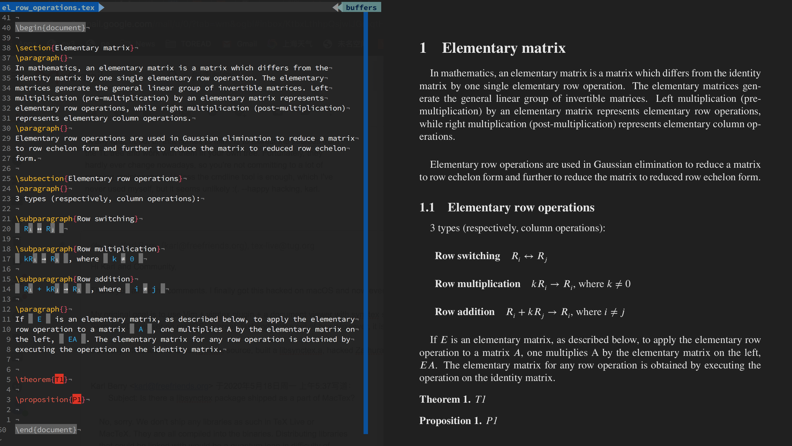

<!--more-->
# Vimtex-Zathura

A method to latex edit and preview side by side

## Purpose

This is about how to integrate Zathura, SyncTeX, and VimTeX for a smooth
LaTeX editing experience.

I use Vim with the VimTeX plugin and a document viewer that supports
[SyncTeX][2], so I can see live PDF updates as I edit my .tex files.
Skim (a PDF viewer on macOS) is fast, works out of the box, and supports
SyncTeX. However, it’s built on Apple’s PDFKit, which doesn’t allow changing
the background color of pages—something I want, especially to match the dark
background of my Vim setup. Zathura supports custom background colors and
would be ideal, but it has no pre-built package for macOS, and its source
doesn’t include SyncTeX support by default. That’s why some workarounds are
necessary.

## How to hack

### build libsynctex.a:
1. Fetch the latest synctex source from https://github.com/jlaurens/synctex
2. Build.  
    Method 1:  
    The README tells how to build the client tool "synctex" with a
    Xcode CLI project, we can easily adapt to a Xcode Library project for
    libsynctex.a.  
    Method 2:  
    I wrote a [Makefile](https://github.com/rltyty/vimtex-zathura/blob/main/Makefile.libsyntex)
    from scratch, just make it.  
    Note: 

        a. -DSYNCTEX_WORK mentioned in README should be -D__SYNCTEX_WORK__
        b. make sure you have zlib
        c. In synctex_parser.c, change "/usr/include/zlib.h" to "<zlib.h>"
            # ifdef __SYNCTEX_WORK__
            //# include "/usr/include/zlib.h"
            # include <zlib.h>

## Hack Zathura build script to link libsynctex.a
1. Follow the instructions of https://pwmt.org/projects/zathura/installation/
to build zathura and the dependencies.  
    Note: No synctex support by now. Check the zathura binary file,

             nm zathura | grep synctex | wc -l
             11

2. Put the synctex source folder in Zathura's source folder, e.g. `zathura-0.4.5/zathura/synctex`.
3. Hack meson.build, to add synctex support.
    Insert the following two lines before "if synctex.found()"
    build_dependencies += synctex
    defines += '-DWITH_SYNCTEX'
    if synctex.found()
4. Remove and recreate "build" folder and redo "meson build"
5. Hack build/build.ninja, to link libsynctex.a.  
   Edit L240, LINK_ARGS of the zathura target, add `-L<path of zathura-0.4.5>/zathura/synctex -lsynctex`:

       LINK_ARGS = -Wl,-dead_strip_dylibs -Wl,-undefined,error -Wl,-headerpad_max_install_names libzathura.a -L<path of zathura-0.4.5>/zathura/synctex -lsynctex ...

6. ninja & ninja install  
   Now, zathura should contain synctex functions. Check again,

        nm zathura | grep synctex | wc -l
        523

[//]: # (vim: tw=78:ts=8:sts=4:sw=4:noet:ft=markdown:norl:)
