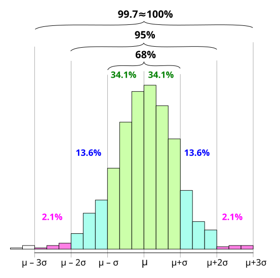
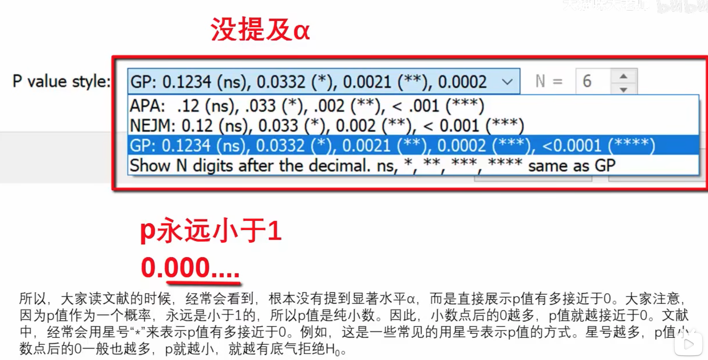
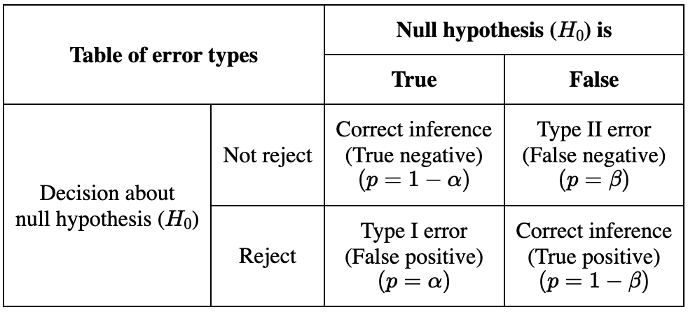

<!--more-->

## 正态分布（Normal Distribution, Gaussian Distribution）

### 大量n重伯努利实验的结果能够产生正态分布曲线

### 伽尔顿（Galton）板实验
- 即使每行向左向右的概率随机(非对称0.5）的，结果依旧服从正态分布，只不过对称轴
  一定在中间$N/2$处

### 中心极限定理（Central Limit Theorem）
- 所研究的随机变量是由大量独立的随机变量相加而成，那么它近似服从正态分布,
  例如:
  - 某市全体市民的身高，收入等等服从正态分布
    - 因为一位市民的身高或者收入是自己的背景，经历等无数独立随机因素作用的结果
  - “中庸者，不偏不倚，无过不及，而平常之理，乃天命所当然。” -- 孔伋《中庸》

### 棣莫弗（de Moivre）
- 铃铛形曲线（bell shaped curve）

### 高斯（Gauss）
- 计算谷神星轨道（用了FFT快傅）期间，发现误差比较小，围绕真实值附近，呈现正态
  分布。真实值就在大量计算结果的对称轴

### 方差，标准差，68-95-99.7法则
- 总体均值（Population Mean）：$\mu$
- 总体方差（Population Variance）：$\sigma^2$
- 总体标准差（Population Standard Deviation）：$\sigma$
- 68法则：在区间$[\mu - \sigma, \mu + \sigma]$，分布着总体中约68%的样本
- 95法则：在区间$[\mu - 2\sigma, \mu + 2\sigma]$，分布着总体中约95%的样本
- 99.7法则：在区间$[\mu - 3\sigma, \mu + 3\sigma]$，分布着总体中约99.7%的样本
- 

### 抽样（采样）分布（Sampling Distribution）

- 均值抽样分布
  - 从5000名大一新生英语成绩表里抽样，每次抽5个分数，统计均值
  - 5000个成绩是总体分布，每次抽5个是样本容量，抽20次是抽样次数，得到抽样分布
  - 样本容量够大，抽样次数够多，抽样分布的对称轴就越接近总体（实际）分布对称轴

- 利用中心极限定理
  - 对总体进行大量重复的随机抽样并计算均值，则均值服从正态分布
  - 对称轴即为总体的均值$\mu$
  - 样本容量越大，所需抽样次数越少, 正态分布轮廓越尖，集中，反之越扁，分散
  - 样本容量越大，方差越小，反之越大
  - 虽让样本容量不同，轮廓不同，但都符合68-95-99.7法则

- 从总体（Population）中抽样，利用样本（Sample）研究总体

### 假设检验（Hypothesis and Test）

- 零假设，原假设$H_0$ (Null Hypothesis)
  - 例如，大一新生和大二老生高考英语成绩没有显出差异，或$\mu_{大一} = \mu_{大二}$

- 对立假设，备择假设$H_1$ （Alternative Hypothesis）
  - 例如，对大一新生只抽样一次，均值落入大二老生成绩分布的极端区域（如5%）， 有理由拒绝$H_0$, 接受$H_1$

- 拒绝域（Rejection Region）
  - 极端，尾巴尖
- 非拒绝域（Acceptation Region or Non-rejection Region）
  - 极端，尾巴尖

- 显著水平（Significance Level）
  - 样本显著偏离总体的程度标准
  - 例如人为规定极端区域左右两侧合计$\alpha = 0.05$
  - 假设检验中用于
    - 控制第一类错误概率的上限（阈值）
    - 判断样本结果是否具有统计显著性，以拒绝原假设 ($p \le \alpha$)

- 临界值（Critical Value）
  - 非拒绝域和拒绝域分界点(cut-off point)，检验统计分布上的一个临界点(threshold point)，用于判断是否拒绝原假设
  - 临界值由显著水平决定，例如分数线由录取率决定，验血指标阴性范围由大量临床实践总结出的阴阳性判断标准决定。
- 已知一个总体分布，对另一个总体抽样，进行假设检验比较两个总体是否存在显著差异
  - 比如，已知去年全年每月消费水平，用今年1，2月作为抽样，预测今年消费水平和去年相比是否存在显著差异
  - 再比如，已知A市职工工资总体分布，用B市一个工资均值抽样去比较，推测两市工资水平是否存在显著差异

### 从均值抽样分布到t分布(Student's t-distribution)

- t分布
  - 用于根据一个小的样本及对应的t-分布，对标准差未知的总体的均值，进行推测。
    - 相当于反推出总体的均值抽样分布, 在一定置信水平下，推测出总体均值的非拒绝域。
  - $t=\frac{\bar{x} - \mu}{s / \sqrt{n}}$
  - 对样本中的每个值减去均值得到的偏离值分布也是对称的

- 无偏估计（Unbiased Estimate）与 “贝塞尔校正”（Bessel's Correction）
  - 总体方差/标准差和样本方差/标准差分母的区别（$N$ vs $n-1$)
    - 在样本标准差公式中除以n-1是一种校正因子，它补偿了样本低估总体方差的趋势，从而确保了更准确和无偏的估计。
      - Dividing by n-1 in the sample standard deviation formula is a correction factor that compensates for the tendency of samples to underestimate the population
variance, ensuring a more accurate and unbiased estimate.

  - 自由度（Degree of Freedom）
    - 已知单次抽样容量为$n$的样本均值和其中$n-1$个数据点, 剩下那1个数据点已经确定
    - 只有$n-1$个数据点可以自由改变
    - 所以用$n-1$来反映用于计算方差的独立信息量

- t检验：单尾检测（One-tailed test）与双尾检测（Two-tailed test）
  - 双尾巴检测(左右各$2.5\%$）：均值抽样结果落在双尾中的一个（拒绝域），则拒绝$H_0$假设, 即拒绝原假设样本所在的总体均值和已知的总体均值一致（没有显著差异）
  - 单尾检测（左$5\%$）：均值抽样结果落在左尾中（拒绝域），则拒绝$H_0$假设, 即拒绝原假设样本所在的总体均值大于已知总体均值
  - 单尾检测（右$5\%$）：均值抽样结果落在右尾中（拒绝域），则拒绝$H_0$假设, 即拒绝原假设样本所在的总体均值小于已知总体均值
- t分布与标准正态分布区别
  - t分布铃铛形状不固定，由自由度决定，而标准正态分布形状固定
  - t分布比标准正态分布的尾巴更粗，更有可能偏离总体均值
  - t分布自由度越大，均值越能反应总体均值，形状越高耸集中，尾巴越细，同一置信水平，临界值越靠近对称轴，方差越小，越接近标准正态分布
  - [一个网站演示多种分布](https://www.statdistributions.com/)

- t分布临界值表（t-distribution critical value table)
  - 根据不同的自由度及置信水平对PDF积分求CDF对应的t值，得到一张临界值表
  - [t-table](./t-table.pdf) or [wiki](https://en.wikipedia.org/wiki/Student%27s_t-distribution#Table_of_selected_values)
- $p-value$
  - In null-hypothesis significance testing, the p-value is the probability of
    obtaining test results at least as extreme as the result actually observed,
    under the assumption that the null hypothesis is correct.
  - 假设原假设为真，则获得与已知样本结果相当甚至更极端的结果的概率
  - 直接比较显著水平 $\alpha$ 和 $p-value$，即可得知抽样结果是否拒绝原假设
  - 预想证明一个假设，先用相反的假设作为原假设(null hypothesis)，然后计算得到p-value足够小，从而拒绝原假设，支持备则假设（alternative hypothesis）。因为出现比已知观测结果（抽样样本）更背离“真实”值的概率越小，说明已知观测结果（抽样样本）已经足够背离“真是”值，说明已有证据不支持原假设，从而支持对立假设。
  - 
- 第一类错误（Type I Error）与第二类错误（Type II Error）
  - 第一类错误又叫假阳性（False Positive）, 主动的，激进的，根据新的误导信息，否定现状
  - 第二类错误又叫假阴性（False Negative）, 被动的，保守的，忽视新的信息，放任错误不管
  - 

### 置信区间
- 点估计: 用一次抽样计算得出的样本统计(Sample statistics)值，估算总体参数(Population parameter)值
- 区间估计：“以一定把握(置信水平)推测总体参数值介于某个区间”
- 置信区间：上面的估值区间，总体参数值以一定置信水平落在这个区间内
  - 或者说，如果对总体进行大量抽样，对每次抽样按一定置信水平构造出一个接受域区间，那么有置信水平比例的区间包含总体均值
  - 估计总体均值$\mu 范围= \bar{x} + t \times \frac{s}{\sqrt{n}}$
    - $\mu$：假想总体均值
    - $\bar{x}$：样本均值
    - $s$和$n$：样本标准差和容量
    - 标准误（SE，Standard Error）：，是一个统计量的抽样分布的标准差。用来衡量样本统计量在多次抽样之间偏离彼此的程度，可以表明我们样本统计值反映总体参数的精确程度。
    - 均值标准误(SEM，Standard Error of Mean），$SEM = \frac{s}{\sqrt{n}}$，反映样本均值和总体均值的偏离程度。
    - $t$：临界值（Critical Value）表示在一定置信水平下，总体均值最多偏离抽样均值多少个均值标准误, 即点估计的误差范围。
    - 如果未知总体均值，或者没有事先假设总体均值，则可以根据t-表查询得到，进而根据上面公式计算得到总体均值的置信区间。
    - 如果已知或事先假设了总体均值，则可以根据公式计算t值，然后和查表得到的t值比较，如果通过查表得到的$t_{表，样本} > t_{总体，计算}$， 说明样本均值和假设总体均值偏离程度小于样本本身的估计误差，说明样本均值和已知（或假设）的总体均值没有显著差别。不能拒绝原假设。反之可以。
    -用临界值和均值标准误构造置信区间 Sample Mean ± (|Critical Value| * SEM), 即
    -{x} - t \times SEM, \bar{x} + t \times SEM]$
    - 一个思辨
但我认为说总体均值有95%概率落在某次抽样构造的置信区间，和UP倾向的大量抽样构造区间，有95%的区间包含总体均值的说法，其实是一个意思。
因为概率本身就是人们基于已有信息做的主观推测的自信程度。没有所谓的客观概率，概率就是主观的。不同的已知信息，决定了不同的自信程度。当人们知道确切结果了（比如有权限打开那个excel了），自信程度自然就变成1了。即便某次均值抽样偏离了均值抽样分布接受域的一半所构造的区间很可能已经不包含总体均值了，依旧不妨碍我自信地说总体均值仍旧以95%概率落在该区间，因为这就是95%的意义，我没有说99%，100%，我允许这次抽样构造的区间发生意外，成为那5%的极端情况。而且在不清楚总体全部信息之前，你也不知道实际均值是多少，你大量的均值抽样的接受域也不代表100%包含总体实际均值。
再具体点说就是，每次抽样我们构造的置信区间，不就是根据已知的经验，按照置信水平对应的临界值构造的吗？是先有经验和信心，才有的区间。那我当然可以说，某次样本构造的区间，有相应的置信水平，概率，包含总体参数值啊。

### R软件
- 单样本t检验（One Sample t-test）
  - 单样本双边t检验
  - 单样本左尾t检验
  - 单样本右尾t检验
  - [例子](./ex1.pdf)

## NOTES:

### T-distribution

- The t-distribution is a crucial tool in statistics for handling situations
where we're working with small samples and unknown population standard
deviations. It allows us to make more accurate inferences about population
means in these circumstances.

### T-test

- In a typical t-test, the goal is to determine whether to reject or fail to
reject the null hypothesis (H0) based on sample data.

### How does T-test work?

- Critical t-value

  - The critical t-value is the threshold value from the t-distribution table,
determined by:
  - *Degrees of Freedom (df)*: For one-sample t-test, $df = n - 1$, where n is the
  - sample size.
  - *Significance Level (α)*: Commonly set to 0.05 or 0.01
  - *Type of Test*: One-tailed (left-tailed, right-tailed), two-tailed
  - The critical t-value defines the rejection region(s) in the t-distribution.
    If the calculated t-value falls into the rejection region, you reject the
    null hypothesis.

- Calculated t-value (or Calculated t-statistic)

  - It is calculated from the sample data using formula:
    $$ t = \frac{\bar{x} - \mu_0}{s / \sqrt{n}} $$
    which measures how many standard error the sample mean is away from the
    hypothesized population mean.

- Comparison and Decision Rule
  - Two-tailed test

- Reject the null hypothesis if $|{t_{statistic}}| > t_{critical}$

  - One-tailed test

- Reject the null hypothesis if
  - $t_{statistic} > t_{critical}$ in right-tailed t-test, conclusion: "greater than"
  - $t_{statistic} < - t_{critical}$ in left-tailed t-test, conclusion: "less than"

[1 《通俗统计学原理入门》视频教程](https://space.bilibili.com/446313875/channel/)
