# 数量关系

[***📝习题索引***](http://korhal.h4ck.me:8080/RKB/职测资料/数量关系)

## 1 比例关系

**[技巧]** 和倍

  $x+y = S$, $x/y = m$, 则$y = S\frac{1}{m+1}$, $x = S\frac{m}{m+1} = S - y$

**[技巧]** 差倍

  $x-y = S$, $x/y = m$, 则$y = S\frac{1}{m-1}$, $x = S\frac{m}{m-1} = S + y$

**[技巧]** 和差

  $x+y = m$, $x-y = n$, 则$y = \frac{m-n}{2}$, $x = \frac{m+n}{2}$

  - 002271:2 父母年龄和是年龄差的23倍, 立刻得父亲$(1+23)x/2 = 12x$,
    母亲$(23-1)x/2=11x$

**[技巧]** $a:b = m:n$, 则$a+b$是$m+n$的倍数

**[技巧]** 速度比$3:2:5$, 同样路程, 时间比$\frac{1}{3}:\frac{1}{2}:
   \frac{1}{5} = 10:15:6$

**[技巧]** 特殊值代入: 如果题干都是相对关系, 没有具体数量和单位, 如“率”,
“占比”等等, 可以设特殊值简化运算.

  - **赋值法**: 确定比例关系后赋值简化运算, 192500:2, 189928:1
  - **赋值法**: **[重做!!!]** 份数赋值快速解题, 047139:1,2

  - **[技巧]**: 131791:2 (特别的方法)

**[重做!!!]** **[经典!!!]**  030731:2 一二季度降雨量比去年同期分别增加$11\%$,
$9\%$, 两季度增加的绝对量相同, 问上半年同比增长多少? (A. 9.5% B. 10% C. 9.9%
D. 10.5%)

  - 解: 如果一二季度去年同期相等, 则半年同, 比增$(9\% + 11\%)/2 = 10\%$,
    由于两季度绝对增量相同, 2季度幅度小, 所以2季度基础量大,
    上半年同比增幅更接近$9\%$, 排除B,D

    设绝对增量为99, 则$99 \times 2 / (99/11\% + 99/9\%) = 9.9\%$

**[重做!!!]** 000019:1 某公司去年有员工830人，今年男员工人数比去年减少6%，
女员工人数比去年增加5%，员工总数比去年增加3人。问今年男员工有多少人?
(A. 329, B. 350, C. 371, D. 504)

**[重做!!!]** 000019:3 甲乙共100千克, 甲降价$20\%$, 乙提价$20\%$后,
均为9.6元/千克, 总价值少140元, 求甲重量. (A. 25 B. 45 C.65 D. 75)

解1: $0.8x = 1.2y = 9.6$, $x=12, y = 8$, $a + b = 100$, $12a + 8b = 960 + 140
= 1100$, $a = 75, b = 25$

解2: 非常规, 因为$a + b = 100$, 所以答案一定A或者D, 代入, 后者降价的总价值占比
大, 选D

解3: 共100千克，总价少140元，均价少1.4元，原先均价$9.6+1.4=11$元，利用十字交叉
法：$ (11 - 9.6 / 1.2) ： （9.6 / 0.8 - 11） = 3:1 $, 所以，甲75千克

**[重做!!!]** 000019:2

**[重做!!!]** 027645:3

前一半路程降速$\frac{1}{8}$, 如果按原计划时间走完全程, 后半程升速几分之一?
- 解1: 速度$7:8$, 时间$8:7$, 时间多了$\frac{1}{7}$,
后半程时间需要减少$\frac{1}{7}$, 时间比$6:7$, 速度比$7:6$, 提速$\frac{1}{6}$
- 解2: 调和平均$\frac{2 \times 7 x}{7+x} = 8$, 得$x = \frac{56}{6}$,
$\frac{56}{6} / 8 = \frac{7}{6}$, 提速$\frac{1}{6}$.

### 1.1 合作效率工期问题

  无论已知条件是速度比还是时间比, 都可以通过最小公倍数, 为总量赋值

  - 甲10天做完, 乙15天做完, 公倍数30天工作量, 甲效率3, 乙效率2,
    合作效率5, 工期6

    - 也可直接套用公式：$T_{合作} = \frac{T_{A}T_{B}}{T_{A} + T_{B}}$

  - **[经典!!!]** **[重做!!!]** 007171:5
    - 甲乙合作16天, 乙丙合作12天, 丙丁合作16天, 甲丁合作几天?
      - $V_1+V_2=\frac{1}{16}$ (1), $V_2+V_3=\frac{1}{12}$ (2),
      $V_3+V_4=\frac{1}{16}$ (3), (1) + (3) - (2)得$V_1+V_4=\frac{1}{24}$,
      24天

  - 赋值, 放水问题

  **[重做!!!]** **[审题!!!]** 241639:1

  **[重做!!!]** **[审题!!!]** 192500:3

  **[重做!!!]** **[审题!!!]** 086438:2

  **[经典!!!]** 正负交替效率 119849:2
   - 甲乙进, 丙出, 注满或放空时间6:5:3(小时), 轮流开1小时, 多久注满
     - 设总量30, 效率比30/6:30/5:30/3 = 5:6:10, 一个周期5+6-10=1, 30-5-6=19
     19*3 + 2 = 59小时
  **[重做!!!]** 交替工作: 101194:2

  **[重做!!!]** **[审题!!!]** 013217:2 甲乙丙要看清啊

**[技巧]** 比例法统一比例

- 寻找不变量
- 将不变量的份数用最小公倍数统一
- 其它量根据最小公倍数比例变化

  **[重做!!!]** 130780:2 (不变量是哪个? 最小公倍数统一)

  **[经典!!!]** 083124:1 ($\frac{x}{x+16} = \frac{7}{11}$, 4份=16, 7份=28)

  **[技巧]** **[经典!!!]** 083124:2 用份数解决

### 1.2 利润打折问题

  **{ 技巧 }** 几折用`n/10`表示, 比如8.5折, 就是`8.5/10=0.85`

  - 306537
  - 215214:3

  **[技巧]**

  - 301736:1
  解法2: 甲乙原价利润率都是25%, 所以什锦的混合的利润率不变, 即成本:售价=4:5,
  打9折后成本:售价=4:4.5, 利润率为1/8 = 12.5%, 如果利润80元,
  成本640 = 220 × 2 + x. 即x=200

  **[技巧]** 几个百分点用`n/100`表示, 比如相较原有利润率上浮3个百分点, 就是
  `新利润/新成本 - 前利润/前成本 = 0.03`

  **[性质!!!]**

  $$ 打折率 = \frac{折后价}{折前价} = \frac{1+折后利润率}{1+折前利润率} $$
  $$ 利润率 = \frac{利润}{成本} = \frac{售价-成本}{成本} =
     \frac{售价}{成本} - 1 $$
  $$ 售价 = 成本 \times (1 + 利润率) $$
  $$ 成本 = \frac{售价}{1+利润率} $$

  成本不变, 售价比=(1+利润率)比; 售价不变, 成本比=(1+利润率)反比

  **[重做!!!]** 063704:2

  **[重做!!!]** 024020:1,2 快速

  **[经典!!!]** **[重做!!!]** 011234:3
  - 进价是前次进价$80%$, 售价保持不变, 利润率提高30个百分点, 问前次利润率.
    - $\because 成本= \frac{售价}{1 + 利润率}$ $\therefore$ 成本比 与(1+利润率)
      成反比.

      即, $5:4 = (1+x+0.3):(1+x), x=0.2=20\%$

  **[经典!!!]**  **[重做!!!]** 011234:4 十字交叉法
  - 期望利润$50\%$, 售出$70\%$后, 打折, 最后总利润期望的$82%$, 问打几折.

    解: $(0.5 - 0.41):(0.41 - x) = 3:7$ !!! 上下别搞反  $x=0.2$

    又成本不变, 售价和(1+利润率)成正比, 即打折率=(1+折后利润率)/(1+折前利润率)

    $0.1n = (1+0.2):(1+0.5)=0.8$, $n = 8$折

### 1.3 **[技巧]** 利用均值不等式

  $$ \frac{a + b}{2} \ge \sqrt{ab} $$

  其中, 当$a = b$时, 等式成立

  - 269656:1,2 凑配定和型如(a - x)(x - b), 其实就是一元二次函数极值在对称轴处

### 1.4 行程问题

  - $路程 = 速度 × 时间$
  - $相遇路程 = 速度和 \times 相遇时间$
  - $追及路程 = 速度差 \times 追及时间$
  - 分段行程平均速度(调和平均数)
      $$ \overline V = \frac{S}{\frac{S_1}{V_1} + \frac{S_2}{V_2} + \cdots
                       + \frac{S_n}{V_n}} $$
      当$S_1=S_2= \cdots = S_n$,
      $$ \overline V = \frac{n}{\frac{1}{V_1} + \frac{1}{V_2} + \cdots
                       + \frac{1}{V_n}} $$
      当$n=2$,
      $$ \overline V = \frac{2V_1V_2}{V_1 + V_2} $$
      **[注意]!!!**
      $$\text{调和平均数} \le \text{算术平均数}$$
      $$\frac{2V_1V_2}{V_1 + V_2} \le \frac{V_1 + V_2}{2}$$
      也就是说分段行程（每段距离相等）平均速度小于2个速度的平均速度，除非两段
      速度一样。另外也可得出，船往返于上下游A，B两地的平均速度小于船在静水中
      的速度，除非水流速度为0。

  - $速度比 = 步长比 \times 步频比$
    - 003085:4 兔领先狗10米, 狗兔步长比9:5, 步频比2:3(狗跑2步时间=兔3步时间),
    问狗跑多少米追上兔, 兔这期间跑了多少米? (60米, 50米)

  - **[重做!!!]** 003085:1

  - 相向而遇:
    - 错车而过:路程为两车长度之和, 相对速度为两车速之和
    - 车过桥:路程为车桥长度之和
      - 过大桥, 过小桥: $速度 = \frac{大桥-小桥}{时间差}$
      - 完全在桥时间: $速度 = \frac{桥-车}{时间差}$
    - 操场互为反向跑圈

  - 同向追及
    - 操场同向追逐跑圈

#### 1.4.1 两地往返多次相遇(柳卡折线图)
- 题型

  - 求一定时间内相遇次数
  - 求某两次相遇点间距, 或根据点间距求全程
  - 相向出发第一次***迎面***相遇距离$A$点距离$S_{1}$,
    第二次***迎面***相遇距离$B$点距离$S_{2}$, $L=3S_{1}-S_{2}$
  - 相向出发第一次***迎面***相遇距离$A$点距离$S_{1}$,
    第二次***迎面***相遇距离$A$点距离$S_{2}$, $L=(3S_{1}+S_{2})/2$

- 分析步骤:

  1. 确定速度比$M:N$, 路程比也永远是$M:N$, $M$个全程对应$N$个全程, 以下$M>N$.
  2. 确定出发方式, 同起点$(A, A)$, 还是两地相向$(A, B)$.
  3. 画柳卡图, 刻度长M, 这是半周期.
  4. 用全周期计算余数, 确定交点位置. 也可用半周期计算,
     但要根据商是奇/偶判定是第一半周期, 还是第二半周期.
  5. 计算交点位置所处全程中的比例(相似三角形上下两个底边的刻度比)

- 规律

  - 奇数次全程, 停留在起点的对岸, 偶数次, 回到起点
  - 柳卡图折线斜率$\tan(\alpha) = \frac{\Delta S}{\Delta t}$, 代表速度(率)
  - 设$L$为$A, B$间距, 由柳卡图可知
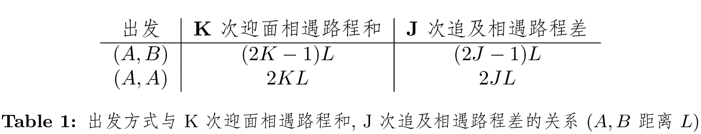
    - 只要速度有差别, 不论$(A,B)$还是$(B,A)$, 总有追及相遇, 只要路程差达到$2JL$
    - 相同速度, 出发方式$(A,B)$, 因速度差永远是0, 永远不可能追及相遇,
      迎面相遇点永远在两地中点
    - 在同侧岸边相遇, 即迎面和追及在半周期处重合, 只能算一次相遇
    - **[重做!!!]** 095526:1
  - 速度比和出发方式决定结束方式和相遇次数(结束指半周期, 即速度1完成$M$次
  全程)
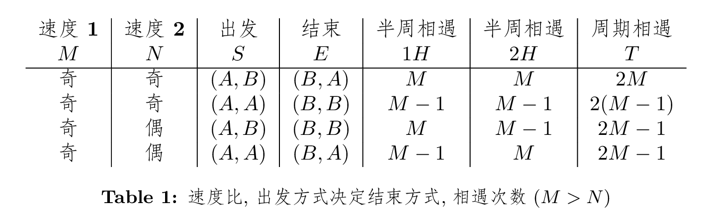

    - 奇:奇, $(A,B)$, 永不能在岸边相遇
    - 第二半周期和第一半周期关于半周期处$M$轴对称, 如果半个周期交点是$H$个,
      那么第$H+x$个交点的位置和第$H-x$个交点位置相同($x < H$)

  - $相遇次数 = 迎面相遇次数 + 追及相遇次数 - 岸边相遇次数$
  - $半个周期的交点数 = M$, 因为快速的每一次全程必然会且仅会遇见一次慢速的
  - $半个周期相遇次数 = M$, 如果起点不同, 出发方式$(A,B)$
  - $半个周期相遇次数 = M-1$, 如果起点相同, 出发方式$(A,A)$

- 例子

  $七元组(前半迎遇, 前半追遇, 前半总遇, 后半迎遇, 后半追遇, 后半总遇, 总遇)$

  $周期总遇 = 前半总遇 + 后半总遇$

  - $(5, 3, A, B)$ - $(4, 1, 5, 4, 1, 5, 10)$

    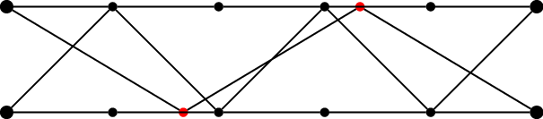

  - $(5, 3, A, A)$ - $(4, 1, 4, 4, 1, 4, 8)$

    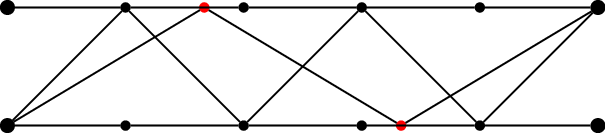

  - $(7, 1, A, B)$ - $(4, 3, 7, 4, 3, 7, 14)$

    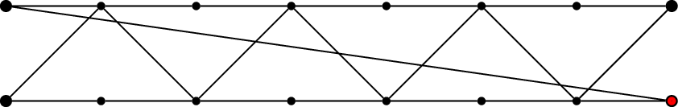

  - $(7, 1, A, A)$ - $(4, 3, 6, 4, 3, 6, 12)$

    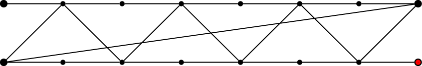

  - $(7, 2, A, B)$ - $(5, 3, 7, 4, 2, 6, 13)$

    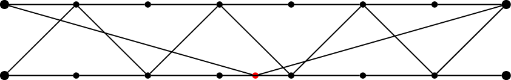

  - $(7, 2, A, A)$ - $(4, 2, 6, 5, 3, 7, 13)$

    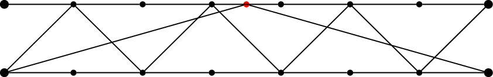

  - $(6, 5, A, B)$ - $(6, 1, 6, 5, 0, 5, 11)$

    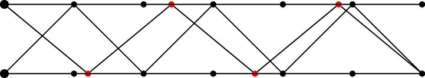

  - $(6, 5, A, A)$ - $(5, 0, 5, 6, 1, 6, 11)$

    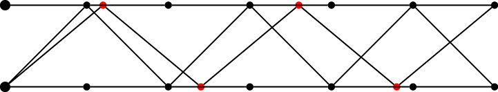

#### 1.4.2 水中行舟

  - 顺水: $V_顺 = V_船 + V_水$
  - 逆水: $V_逆 = V_船 - V_水$
  - 静水: $V_船 = \frac{V_顺+V_逆}{2}$
  - 漂流: $V_水 = \frac{V_顺-V_逆}{2}$ $T_静 =
    \frac{2T_{逆}T_{顺}}{T_{逆}-T_{顺}}$

     - 002271:1 顺水6.75小时, 返回9小时, 问漂流用时 $(2*6.75*9)/(9-6.75) = 54$

#### 1.4.3 载人过河

  - $M$个人过河, 船能载$N$人, 需要$A$个人划船, 需要往返$\frac{M-A}{N-A}$次运载.
    - 无特别说明, 默认$A=1$

#### 1.4.4 沿途遇车

  - 每隔$T_追$被公车背后追及, 每隔$T_迎$与公车迎面相遇, 则发车间隔$\Delta T$

  $$\Delta{T} = \frac{2T_追T_迎}{T_追 + T_迎}$$

  车人速度比

  $$\frac{V_车}{V_人} = \frac{T_追 + T_迎}{T_追 - T_迎}$$

  并且$T_追 \gt \Delta T \gt T_迎$

  $\because$
  $$ V_{车} \Delta{T} = (V_{车} - V_{人}) T_追$$
  $$ V_{车} \Delta{T} = (V_{车} + V_{人}) T_迎$$

#### 1.4.5 环形运动

  $P$为周长, $T$为相遇间隔
  - 反向运动: 第$N$次相遇, 路程和$S_1 + S_2 = NP$, $P = (V_1 + V_2) T$
  - 同向运动: 第$N$次相遇, 路程差$S_1 - S_2 = NP$, $P = (V_1 - V_2) T$

  例题:

  **[审题!!!]** 026412:1

  **[经典!!!]** 026412:2 速度和:速度2

  **[经典!!!]** 026412:3 速度差:速度1:速度2,

  对应追及的圈数比1:V1/速度差:V2/速度差

#### 1.4.6 扶梯上下逆行

  - $扶梯总长=人走的阶数 \times (1 \pm \frac{V_梯}{V_人})$, 逆行是减

  **[经典!!!]** **[重做!!!]** 028515:2
  - 解: 甲乙路程比$36:24=3:2$, 速度比是$2:1$, 那么时间比就是$1.5:2=3:4$
      则人梯合速比是$4:3$, 可知梯:甲:乙速比为$2:2:1$, 梯速和甲速相同, 路程
      也应该相同, 所以扶梯总长$36 \times 2 = 72$

  **[经典!!!]** **[重做!!!]** 004416:4

  女孩从扶梯向上走40阶到顶, 男孩从扶梯向下走80阶到底, 男速2倍女速, 求层间阶数.
  - 解: $S = S_{女} \times (1 + \frac{V_梯}{女})
           = S_{男} \times (1 - \frac{V_梯}{男})$, (注: 逆行 '-')

    $40 (1 + a) = 80(1 - a/2)$, $a=0.5$, $S = 40 (1 + 0.5) = 60$

#### 1.4.7 队伍行进

 - 队头 -> 队尾: $队伍长L = (V_人 + V_队) \times T$
 - 队尾 -> 队头: $队伍长L = (V_人 - V_队) \times T$

#### 1.4.8 钟表问题

 - $360\degree = 12小时= 60分= 60秒$ 表盘上时针$1小时$对应分针$5分钟$
 - $V_时 = 30\degree/时 = 0.5\degree /分$
 - $V_分 = 360\degree/时 = 6\degree /分= 0.1\degree/秒$
 - $V_秒 = 21600\degree/时 = 360\degree /分= 6\degree/秒$
 - $V_分 = 12V_时$, $\Delta{V} = V_分 - V_时 = 5.5\degree/分 = 330\degree/时$
 - $V_秒 = 60V_分$, $\Delta{V} = V_秒 - V_分 = 354\degree/分 = 5.9\degree/秒$
 - $H:M$时刻时针与分针夹角$\alpha_{HM}=30\degree (H \mod 12) - 5.5\degree M$
 - 分针时针可以看作$12:1$的环形同向追及问题

   - 每次重合, 间隔$\frac{360}{360-30}=\frac{12}{11}小时$, 即12小时重合11次,
   一天22次
   - 每次$180\degree$直线, 每超半圈间隔$\frac{180}{360-30}=\frac{6}{11}小时$, 去掉一半重合, 即12小时重合$\frac{12}{\frac{6}{11}} \times \frac{1}{2}=11$次,
   一天22次
   - 每次垂直, 每超$90\degree$, $\frac{90}{360-30}=\frac{3}{11}小时$, 去掉
   $0\degree$, $180\degree$, 保留$90\degree$,$270\degree$, 即12小时垂直
   $\frac{12}{\frac{3}{11}} \times \frac{1}{2} = 22$次, 一天44次
   - 其它任意角度都是12小时22次, 一天44次, 而重合与$180\degree$
     12小时出现11次, 一天22次
     - 因为速度$12:1$, 时针1圈, 分针12圈, 这是一个出发(A,A)结束(A,A)的问题,
     分针超越时针11次, 最后回到0点. 每1次扣圈$360\degree$过程, 任意指定夹角
     出现2次, $\alpha$和$360-\alpha$(除了$\alpha=0\degree$或者$\alpha=180$),
     所以其它任意夹角12小时出现 $2 \times 11 = 22$次, 一天44次,
   - 时针和分针第$N$次重合在$N \times \frac{12}{11}$小时, $N + \frac{N}{11}$        小时
     - 从时针角度看, 时针在$N$小时处偏移$(\frac{N}{11} \times 5)$分钟处, 或者
     $N \times 5 + \frac{N}{11} \times 5$分钟处
     - 从分针角度看, 分针停在$\frac{N}{11} \times 60$分钟处
 - 坏钟问题
   - 算出坏钟与标准钟的速度比, 按比例求解
     - 钟快$3分/小时$, 晚上11点对表, 第二天坏钟6点时, 求标准时间
       - $63:60 = 21:20 = 7*60:M$, $M = 400 = 6:40$, $T = 5:40$

#### 1.4.9 牛吃草

  - $G$:当前草量 $N$:牛数量 $x$:草长速度(牛/天) $T$:吃完草时间

    - $G = (N-x)T$
    - $x = \frac{N_1T_1 - N_2T_2}{T_1-T_2}$,

  - 一片草地(草匀速生长), 240只羊可以6天, 200只羊可以吃10天,
    可供190只吃几天?

      $x = \frac{N_1T_1 - N_2T_2}{T_1 - T_2} = 140$, $G = (240-140) \times 6 =
      600$

      $T_3 = 600 / (190 - 140) = 12$

  - 变种题: 草长改降雨, 改河沙沉积, 改检票口前来检票旅客

    例子: 018674:2

    某市保持年降水量不变, 水库水够12万人用20年, 新增人口3万人, 可维持15年,
    如果在此基础上想维持30年, 市民要节约用水多少比例?

    $(12-f) \times 20 = (15-f) \times 15 = (x -f) \times 30$, $x=9, 6/15=2/5$

#### 1.4.10 复杂行程问题

  - 008426:3 只有1辆校车, 2个班级从学校出发去少年宫, 1班坐车, 2班步行同时出发,
    途中某处车放下1班, 返回接2班, 1班改步行, 最后车载2班和1班同时到达少年宫.
    已知学生步行速度4公里/小时, 载人车40公里/小时, 空车50公里/小时.
    求1班步行路程占学校到少年宫总路程多少? (1/7)

    解1: 2个班同时出发同时到达, 车只有空车和载人两种状态, 学生只有步行和坐车
    两种状态, 一个班级步行时间分两部分, 另一个班坐车的时间部分和空车时间部分,
    空车部分, 两个班都在步行, 这部分时间相同, 剩下的步行时间就是另一班坐车时
    间. 所以两个班坐车时间相同, 步行时间相同.

        a    e  b                     c  f    d

    ad全程, ab = cd = 每个班步行路程, 车在c点回接, cb是空车, ac:ae=10:1,
    eb=cf, eb:bc = 4:50 = 2:25, 如果ac10份, ec对应9份, eb=9*2/27 = 2/3,
    cd/ad = (2/3 + 1)/(2/3 + 1 + 10) = 5/35 = 1/7

    解2: $ab = cd$, 1班从c点和车分开, 步行cd一段时间设为10份, 则
    $T_{空车cb}+T_{车人bc}+T_{车人cd} = 10$, $T_{车人cd}=1$, 
    $T_{空车cb}+T_{车人bc}=9$, $V_{空车}:V_{车人} = 5:4$, 所以$T{车人bc}=5$
    即$T_{车人ab} = T_{车人cd} = 1$, $T_{车人bc}=5$, 所以cd占1/7. 

#### 1.4.11 例题

  - 利用正反比快速求解
    - 318915:1,2
    - 300044:2
      + 提前出发T, 后来者居上, 意味相同路程少用T时间, 对应速度比份数之差,
        从而得出这段追赶路程对应的时间
    - 290734:2
      + 依旧是速度比, 时间反比, 比例分数差对应实际时间差或速度差,
        得出1份时间差或速度差
    - **[重做!!!]** 279353:1 258325:2 (审题)
    - **[经典!!!]** 087667:6 (公倍数)
    - **[重做!!!]** 78994:3

  - 整除快速排除
    - 017135:1 甲乙速$5:4$, 乙从B站先出发开往A站, 距离B站75km, 甲从A站出发,
      相遇地点距离AB两站距离比3:4, 求AB间距
      - 速度比5:4, 路程比就是9份, 72也能被9整除, 所以全长也被9整除, 只有C
      这里答案都是整数, 所以认为能整除

  - 份数快速求解: 016172:3

    去程4倍速, 回程1倍速, 共1小时, 单程2倍速多长时间?

      - 解法一: 1/4 + 1 = 5/4 对应1小时, 1/2 / 5/4 * 1 = 2/5小时
      - 解法二: 1小时来回的平均速度2(4)*1/(4+1)= 8/5, 来回路程8/5 * 1,
        单程4/5, 时间 4/5 / 2 = 2/5小时 

### 1.5 溶液浓度问题

$$ \text{浓度} = \text{溶质} \div \text{溶液} $$
$$ \text{溶液} = \text{溶质} + \text{溶剂} $$

**( 重做!!! )** **( 技巧 )** 溶质变化问题 248655:2

** 溶剂变化 ** 155942:1

例: 盐水, 第一次加定量水, 浓度变为$6\%$, 再加等量水, 浓度$4\%$, 再加等量水,
浓度?

解: 浓度从$6$到$4%$, 比例$3:2$, 溶液比例$2:3$, 即溶剂加了溶液的一半, 所以
$6/100 -> 6/150$, 进而$6/200 = 3\%$

### 1.7 十字交叉法

  - $T1 : T2 = (V - V2) : (V1 - V)$

    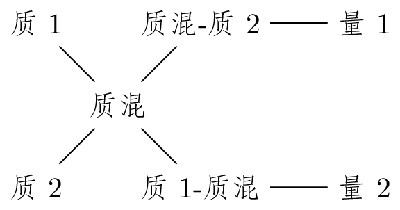

  - $T1 : (T23) = (V - V23) : (V1 - V), \text{其中} T23 = T2 + T3$

    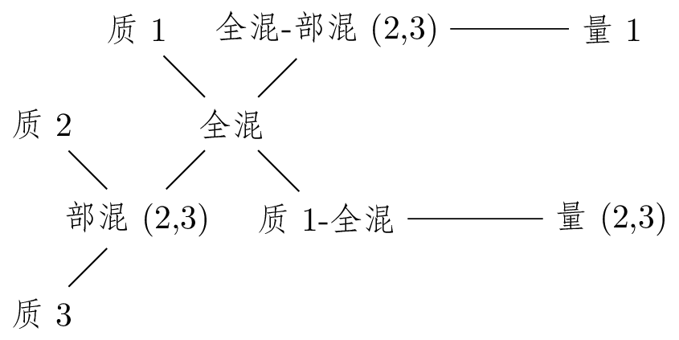

这里“质”可以是各种单位物质量(密度),比如密度,浓度,效率,速率,单价等等 

### 1.8 其它

  - **[重做!!!]** 004280:1

  长方体棱长的和是48，其长、宽、高之比为3:2:1，则长方体的体积是? 48

## 2 极值问题 - 和定最值

- 已知多量之和, 求某个量最大/最小值: 求最大, 其它量尽可能小; 求最小, 其它量尽
可能大

  **[注意]** 约束条件, 是否整数(整数结果反向取整), 可否几个量相同
  - 345873:2
  - 292995:1

  **[经典!!!]** 182529:1

  **[重做!!!]** 113357:3

  **[技巧]** 011362:2 先把已知数字计算出来, 然后$x-2, x-1, x$ 可以根据4个答案
  排除

  **[重做!!!]** 003950:2 10个箱子总重100, 最重3个不超过最轻3的1.5倍,
  问最重一个最重多重.

  解: $x + 9y = 100$, $x+2y \le 4.5y$, $x <= 500/23$

## 3 排列组合

- 捆绑法: 先内部排列组合, 再作为1个整体加入排列($P^m_m \times P^{n+1}_{n+1}$)
  - $n$对夫妻排列: $(P^{2}_{2})^n \times P^{n}_{n}$
- 插空法: 先把其它元素全排列, 再把要求不相邻的元素插到`n+1`个空隙里(
$P^{n}_{n} \times P^{m}_{n+1}$)
  - **[重做!!!]** 303869:2
  - 196261:4
  - 136780:2
- 装箱插板法: $n$个相同小球要放入$m$个盒子, $C^{m-1}_{n+m-1}$
  - 相当于用$m-1$个挡板隔$n$个苹果, 从$n+m-1$个位置挑出$m-1$个位置插挡板
- $n$个人围成一圈: $P^{n-1}_{n-1}$
  - $n$对夫妻围一圈: $(P^{2}_{2})^n \times P^{n-1}_{n-1}$
- 优限法: 先满足约束条件, 再全排列
- 间接法: 先算补集, 情况较少的, 再用总数减. 336979:4
- 定位法: 适用于需要同时考虑相互联系的两个元素的情况, 于是先将一个固定,
- 然后考察另一个事件的概率
  * 同排问题
    * 309452:1 298467:1,2
  * 重合
    * **[重做!!!]** 288438:2 276344:3

- 错位排列($N$个元素都不排在自己原来的位置)
  - 一个元素无法错位重排
  - 两个元素a, b:       ba
  - 三个元素a, b, c:    cab, bca
  - 四个元素a, b, c, d: dabc, cdba, cadb, dcab, bdac, bcda, badc, cdab, dcba
  - N个元素的错位重排

  想象成:
  1) 新加入的第$N$个元素和$S_{N-1}$中每一个错位排好的排列里的每一个元素
  互换位置, 一共$S_{N-1} \times (N-1)$,  
  2) 新加入的第$N$个元素和差一个位置就排好的$N-1$个元素组成的排列的那个
  没排好的元素互换位置, 这种排列的个数就是先把$N-1$个元素中的一个固定在
  原位, 对其它$N-2$个元素进行错位排列, 一共$S_{N-2} \times (N-1)$

  所以总共, $S_1 = 0$, $S_2 = 1$, 
  $$\begin{align*}
    S_n &= (n-1)S_{n-1} + (n-1)S_{n-2} \\
        &= (n-1)(S_{n-1} + S_{n-2}) \\
        &= nS_{n-1} + (-1)^n
  \end{align*}$$

  $$\begin{align*}
  S_3 &= 3(S_2 + S1) + (-1)^3 &= 3*1 - 1    &= 2 \\
  S_4 &= 4S_3 + (-1)^4        &= 4*2 + 1    &= 9 \\
  S_5 &= 5S_4 + (-1)^5        &= 5*9 - 1    &= 44 \\
  S_6 &= 6S_5 + (-1)^6        &= 6*44 + 1   &= 265 \\
  S_7 &= 7S_6 + (-1)^7        &= 7*265 - 1  &= 1854
  \end{align*}$$

  - 例201185:1

- 注意排列和组合计算, 别混淆
  - **[重做!!!]** 186055:1
  - **[重做!!!]** 053125:2 列车25站, 任意两站价格不同, 几种票, 几种票价
    - $P^2_{25}$, $C^2_{25}$

- 分步与分类

  - 类间相加, 步间相乘

    - 312058:2

### 3.1 概率

  - **[经典!!!]** **[重做!!!]** 121690:1 (概率相加的前提是不能有交叉事件,
    彼此独立)
    - A,B,C三个方案: $A$被接受概率$40%$, 如果$A$被接受, $B$的被接受概率$60%$,
      反之$30%$, 如果$A$, $B$均不被接受, $C$被接受概率$$, 概率$90%$, 反之$10%$
      对三种方案被接受概率排序.                              (40%, 42%, 43.6%)

      - 解: $P(A) = 40\%$, $P(B) = 40\% \times 60\% + 60\% \times 30\% = 42\%$

        $P(\overline{A \cup B}) = P(\overline{A} \cap \overline{B}) = 60\%
        \times (1-30\%) = 42\%$

        $P(A \cup B)=1 - 42\%=58\%$

        $P(C) = 42\% \times 90\% + 58\% \times 10\% = 43.6\%$

  - 古典概型

    - 014082:1 标号1-10的小球在盒子里, 取出2个, 和为6的概率
      - (1,5), (2,4), =2/C(2,10),     (3,3)像话吗?

    - 013559:1 甲乙丙3人假日值班3天, 甲在乙前的概率. $C(2,3)/P(3,3)=3/6=1/2$

    - 013559:2
      - 3种面值硬币各1枚, 抛向空中, 落地恰有2枚正面概率.$C(2,3)/2^3=3/8$
      - 至少两枚正面概率 1/2
      - 恰有一枚正面概率 3/8

    - 011362:1 扑克牌去掉大小王, 每人摸两张, 至少多少人才能保证有两人摸到相同
      花色. $C(2, 4) + 4 + 1 = 11$

## 4 容斥原理(inclusion-exclusion principle)

  - 集合的基数(或势) $|A|$
  - 两集合容斥原理

  $$ |A \cup B| = |A| + |B| - |A \cap B| $$

  **[重做!!!]** 251719:4

  - 三集合容斥原理

  $$ |A \cup B \cup C| =
  |A| + |B| + |C| - |A \cap B| - |B \cap C| - |C \cap A| + |A \cap B \cap C| $$

  **[注意]** 审题要仔细: 区别两个集合的交集和只属于两个集合

  - 三集合容斥的非标准型:

  $$ \begin{align*}
       |A \cup B \cup C| = |A| + |B| + |C|
         - (|A \cap B| - |A \cap B \cap C|) \\
         - (|B \cap C| - |A \cap B \cap C|) \\
         - (|C \cap A| - |A \cap B \cap C|) \\
         - 2|A \cap B \cap C|
  \end{align*}$$

  上式可解释为:至少满足三个条件其一的个数 = 满足条件1的个数 + 满足 条件2的个数
  +满足条件3的个数-只满足其中2个条件的个数-2×(3个条件都满足的个数)

  - 282213:1
    - 只报名参加两场讲座的人, 是不包括三场讲座都报名的人的

  - 容斥极值问题(交的最小值)

    “都...至少...”: **[经典!!!]** 207666:1

      $$
      min(A_1 \cap A_2 \cap \cdots \cap A_n) = |A_1| + |A_2| + \cdots + |A_n|
      - (n-1)|I|
      $$

    解法1: 集合反向构造, 反向, 加和, 做差

      德摩根定律(交的补等于补的合, 合的补等于补的交)
      $$ \overline{A \cap B \cap C}  =
      \overline{A} \cup \overline{B} \cup \overline{C} $$
      $$ \overline{A \cup B \cup C}  =
      \overline{A} \cap \overline{B} \cap \overline{C} $$
      所以

      $$
      \begin{align*}
        min(|A \cap B \cap C|)
           &= min(|I - \overline{A \cap B \cap C}|) \\
           &= min(|I| - |\overline{A \cap B \cap C}|) \\
           &= |I| - max(|\overline{A \cap B \cap C}|) \\
           &= |I| - max(|\overline{A} \cup \overline{B} \cup \overline{C}|) \\
           &\ge |I| - (|\overline{A}| + |\overline{B}| + |\overline{C}|)
      \end{align*}
      $$

      $$ 100 - [(100 - 80) + (100-70) + (100-60)] = 100 - 90 = 10$$

    解法3:

    已知
      $$
        A \cap B = A - \overline{B} = A - (I - B) \\
        |A - B| \ge |A| - |B|
      $$
      - 注: 当$B \subseteq A$时, 上式取等号

    则
      $$
      \begin{align*}
        min(|A \cap B|) &= min(|A - (I - B)|) \\
                        &\ge |A| - |I - B| \\
                        &= |A| - (|I| - |B|) \\
                        &= |A| + |B| - |I|
      \end{align*}
      $$
      - 注意: 如果$|A| + |B| - |I| \lt 0$, 最小值就是$0$, 交集为空

    类似地,
      $$
      \begin{align*}
        min(|A \cap B \cap C|) &= min(|A \cap B- (I - C)|) \\
                        &\ge |A \cap B| - |I - C| \\
                        &\ge |A| + |B| - |I| - (|I| - |C|) \\
                        &= |A| + |B| + |C| - 2|I|
      \end{align*}
      $$

      以此类推,
      $$
      min(A_1 \cap A_2 \cap \cdots \cap A_n) = |A_1| + |A_2| + \cdots + |A_n|
      - (n-1)|I|
      $$

    对于本题, $80 + 70 + 60 - 2 \times 100 = 10$

## 5 其它常见问题

### 5.1 年龄问题

- 年龄差是常量: $A - B = c$
- 年龄倍数关系会随着时间推移而变小, 因为小的年龄作为分母不断变大,
  而年龄差作为分子保持不变.
- $m$年前: $(A - m) - (B - m) = c$
- $n$年后: $(A + n) - (B + n) = c$

- 列表法: 简单明了!!!
  $$
  \begin{align*}
  &       &个体1 &\textbf{     }  &个体2 \\
  过去\\
  现在\\
  未来
  \end{align*}
  $$

- **[技巧]** 95520:2 倍数, 份数差对应年龄差
- **[经典!!!]** **[重做!!!]** 204666:4
  - 充分利用已知信息, 缩小范围, 从最有可能的一端开始用特殊值试验

- **[经典!!!]** **[重做!!!]** 128327:4

### 5.2 日期问题

  - $365 = 52 \times 7 + 1$, 平年偏移1
  - $366 = 52 \times 7 + 2$, 闰年偏移2

  - **[重做!!!]** 077070:7,8

    2017.7.10 星期X - 2018.8.10 星期Y

    注意: 如果是算两个日期$[D_1, D_2]$(两头包含)一共有几天,
    即一个闭区间有几个整数, 那应该$D_2 - (D_1-1) = D_2 - D_1 + 1$, 但如果是
    $D_2$比 $D_1$多几天, 那就直接减$D_2-D_1$.

    因此, 在计算$Y$比$X$以$7$为周期偏移多少时, 应该时两个日期做差,
    即多几天($\mod7$).

    即, 2018.7.10 比 2017.7.10多365天, 8.10比7.10多31天, 共$396 \equiv 4 \mod
    7$, $Y \equiv X + 4 \mod 7$

### 5.3 植树问题

  - 单边把头: $总长 = (棵数-1) \times 间距$, $棵数 = 总长 / 间距 + 1$
  - 单边不把头: $总长 = (棵数+1) \times 间距$, $棵数 = 总长 / 间距 - 1$
    - 同样总长, $把头棵数 - 不把头棵树 = 2$
    - 2楼间种树
  - 单边环形: $周长 = 棵数 \times 间距$, $棵数 = 周长/间距$
  - 双边: $单边把头 \times 2$
  - 多边形: 相当于环形
    - $周长 = 边长 \times 边数$
    - $边长 = 间距 \times 每边环形计算棵数 \times 边数$
    - $棵数 = 边长/间距 \times 边数$
    - $N边形每边M棵数, 一圈总棵树=N \times (M-1)$
    - 每扩大一圈, 每边棵树$M' = M + 2$, 因此总棵树增加$2N$
    - 特别地, 实心方阵(4边形) 外围棵树$W = 4(N-1)$, 总数$S = N^2 = (W/4+1)^2$, 

  - 例题 009173:1 大楼之间植树, 楼间距100米, 树间距5米, 几棵? $100/5 - 1 = 19$

### 5.4 正负交替问题

  $$ 次数 = \frac{总量 - 一次正量}{正量-负量} + 1 $$

  - 10米深井, 青蛙每次上跳5米下滑4米, 问几次跳出井口?(10 - 5)/(5 - 4) + 1 = 6
  - 14米深井, 青蛙每次上跳5米下滑3米, 问几次跳出井口?(14 - 5)/(5 - 3) + 1 =
    5.5 = 6 

    **[注意]** 别忘记$+1$

### 5.5 空瓶换水问题

  **[经典!!!]** 077072:6
  - 4个空瓶可以换1瓶饮料, 现有36瓶饮料, **最多**可以喝多少瓶?

  $$ M = \frac{N}{T-1} + N = \frac{T}{T-1} \times N $$

  $M = \frac{4}{4-1} \times 36 = 48$

### 5.6 出租车合乘问题
  **[重做!!!]** 017700:1
    - 合乘部分打折算, 独自部分原价

### 5.7 页码问题

  - 一位数9个, 二位数(100-1) - 9 = 90个, 三位数(1000-1) - (100-1) = 900个,
    四位数9000个, 五位数90000个, $N$位数=$10^N-10^{(N-1)}=9 \times 10^{(N-1)}$
  - 所需页码N位数页码总共最多$1 \times 9 + 2 \times 90 + 3 \times 900 +
    \cdots + N \times 9 \times 10^{N-1}$
    - 位数 页数 页码数 不大于该位数所需页码数
    - 1 9 9 9
    - 2 90 180 189
    - 3 900 2700 2889
    - 4 9000 36000 38889
    - 5 90000 450000 488889
    - 6 900000 5400000 5888889
    - N $9 \times 10^{N-1}$ $9N \times 10^{N-1}$ **{N-1}{N-1个8}9**
  - 例:
    1. 一本书204页, 需多少页码? 9 + 90 x 2 + (204-99) x 3 = 189 + 315 = 504
    2. 一本书需要2211个页码, 问书几页?
    解: 189 < 2211 < 2889 所以3位数, (2211-189) / 3 + 99 = 674 + 99 = 773
    3. 将自然数从小到达排成一个大数123456789101112..., 问左起2000位数字是几?
    解: 189 < 2000 < 2889 所以3位数, (2000-189) / 3 = 603 .. 2,
    即603+99+1=703的第二位数字0
    4. 一本书1-62页, 在多加了某一页的情况下, 页码之2000, 问多加的页码是几?
    (1+62)/2 * 62 = 31 * 63 = 1953, 2000-1953 = 47

## 6 数字特性法在数学运算中的应用以及快速解不定方程

- 整除同余性质
- 奇偶性, 倍数, 尾数(往往含5等式)
- 代入排除

### 6.1 常用公式(126898)

$$(a \pm b)^3 = a^3 \pm 3a^2b + 3ab^2 \pm b^3$$
$$a^3 \pm b^3 = (a \pm b)(a^2 \mp ab + b^2)$$

- 比较数字
  - $a - b$ 和 0
  - $a / b$ 和 1
    - $a>0$, $b>0$
    - $a<0$, $b<0$: $a / b \lt 1$, 则$a > b$; $a/b \gt 1$, 则$a < b$
  - 选取中间值$c$做比较, $a > c$ , $c > b$, 则$a > b$. 当做差做商不方便时.

- 整除判定

  对于整除的判定方法, 同样用于对余数的计算

  - $N \equiv (N \bmod 10) \bmod 2(5)$
  - $N \equiv (N \bmod 100) \bmod 4(25)$
  - $N \equiv (N \bmod 1000) \bmod 8(125)$
  - $N \equiv sum(\text{digits of } N) \bmod 3(9)$
  - $N \equiv [(N \bmod 1000) - (N / 1000)] \bmod 7$
  - $N \equiv [(N / 10) - 2(N \bmod 10)] \bmod 7$

    $\because N = 10a + b \equiv 10a + b - 21b \equiv 10a - 20b \equiv 10(a-2b) \\
    \equiv (a - 2b) \bmod 7$, 这里$n/10$, 不影响对因子$7$的判断, 因为2, 5 和
    7 互质
  - $N \equiv [(N / 10) + 4(N \bmod 10)] \bmod 13$

    $\because N = 10a + b \equiv 10a + b + 39b \equiv 10(a + 4b) \equiv a + 4b
      \bmod 13$
  - $N \equiv [sum(\text{odd digits}) - sum(\text{even digits})] \bmod 11$

    $\because$
    $$\begin{align*}
    (10^{2n}a_{2n}) + \sum_{k=0}^{n-1}10^{2k}(10a_{2k+1} + a_{2k}) &\equiv
    (a_{2n}) + \sum_{k=0}^{n-1}(-a_{2k+1} + a_{2k}) \\
    &\equiv sum(\text{odd digits}) - sum(\text{even digits})
    \end{align*}
    $$

  - $N \equiv [N \bmod 1000 - N / 1000] \bmod 7,11, 13$

    $\because$ $7 \mid 1001$, $11 \mid 1001$, $13 \mid 1001$

    也可以 $N \equiv [ N / 1000 - N \bmod 1000] \bmod 7,11, 13$

    例子: 843623, $623 - 843 = -220$ 可以被11整除

  - $(p \times q) \mid N \iff p \mid N \land q \mid N$

- 同余核心口诀：余同取余, 和同加和, 差同减差, 公倍数作周期.

  - 余同：一个数除以4余1, 除以5余1, 除以6余1, 则取1, 表示为60n+1（60为4,5,6
  的最小公倍数, 可取60的任意整倍数）

  - 和同：一个数除以4余3, 除以5余2, 除以6余1, 则取7, 表示为60n+7

  - 差同：一个数除以4余1, 除以5余2, 除以6余3, 则取3, 表示为60n-3

  注:n的取值范围为整数, 可为负值也可以取0.

### 6.2 数字特性法在数学运算中的应用(204666)

- 一定要有结合答案, 快速排除缩小范围, 代入验证, 加速求解的意识, 所谓数量关系
  包含几个备选答案和题干之间的关系

- **[重做!!!]** 204666

**[性质!!!]** 两个整数和与差的奇偶行相同
- 204666:3

**[性质!!!]** 若 $a,b,m,n \in \mathbb{Z}$, $a:b = m:n$, 且$\gcd(m, n) = 1$,
则$m \mid a$, $n \mid b$, $(m+n) \mid (a+b)$, $(m-n) \mid (a-b)$

- 例如:红球是白球的1.6倍=8/5, 则红球是8的倍数, 白球是5的倍数, 数量差是3的倍数

- **[经典!!!]** **[重做!!!]** 倍数问题: 204666:5,6
  - 没卖出去销毁损耗的商品要算到成本里

**[技巧]** 073950:2 快速, 代入, 排除

**[技巧]** 整除倍数代入排除
- 338378:3
- 244698:1 (我的是模糊比较法, 参考答案用整除推断更准确)
- 071042:3,4 (快!快!快!)

**[技巧]** 利用同余性质
- 334020:1: 求下面方程10以内正整数解[`y`能被8整除] $8x + 13y = 120$

**[技巧]** 先利用性质排除缩小范围, 再代入剩余, 快速解题
- 334020:2,3 329291:1 327577:1 327577:3 204666:1 106515:1

**[重做!!!]** **[审题!!!]** 106515:2

**[重做!!!]** 204666:2

例如327577:3, 酒店13%不是标间, gcd(13, 100) = 1, 总房间数一定被100整除
另一个酒店12.5%(1/8)不是标间, 总房间数是8的倍数

**[技巧]** 不定方程组

奇偶直接筛出答案, 有时要观察4个答案的特点, 如果3偶数1奇数
- **[重做!!!]** 195558:1

**[技巧]** 有5的等式, 往往用尾数法
- 325837:1
- 323561:2
- 273344:4 **[重做!!!]** 5 和 奇偶, 审题什么是扣
- 254951:1 答案解析提供另一种方法, 要想买得多, 尽可能买便宜点
- 254951:3 **[重做!!!]** $8x$ 倍数尾数为0, $x$可以是5或0 
- 025009:1 $271 = 37x + 20y$, $37x$尾数一定1, x尾数1定3 

**[技巧]** 一长串数字求和, 如果四个选项尾数不同也可以尾数法快速筛选
- 223299:1

**[重做]** 329291:2

**[技巧]** 代入赋值, 如果关系是百分比的, 可以试着把某个基础量用100代入
- 244698:3

**[技巧]** 综合运用整除倍数关系, 先排除缩小范围, 再代入
- 234414:1

**[审题!!!]**
- 234414:2

- 周期间隔问题

  每隔`n`天: 周期是`n+1`, 每`n`天:周期是`n`

  **[重做!!!]** **[审题!!!]** 221950:5 

- 特值法解不定方程

  **[经典!!!]** **[重做!!!]** 216894:3
  三元一次方程, 已知2个独立方程, 求a+b+c. 设a=0, 解得b和c, 从而得a+b+c

**[经典!!!]** 三元一次方程组, 已知两个方程$f(a,b,c)=F$, $g(a,b,c)=G$
求$h(a, b, c)$.

  - 解法1: **配系数法**, 设法联立两方程凑成$h = r \times f + s \times g$
  - 解法2: **赋0法**, 设$a=0$, 解出$b, c$, 再代入$h$
  - 例子: 195558:3

**[技巧]** 106515:3 小王-3 = 小L, 年龄永远大三岁, 只有B符合

**[重做!!!]** 95515:2

  - 男员工今年减少$6\%$, 意味着今年是去年$94\%=\frac{94}{100} = \frac{47}{50}$
    $今年:去年=47:50$, 所以今年能被$47$整除

**[重做!!!]** 029966:2 一方面要快, 要对$4/9$要敏感, 快速排除, 反向代入快得答案
另一方面, 审题要仔细, 正向计算也要快

**[经典!!!]** **[重做!!!]** 025009:3  $16x + 10y + 7z = 150, x > y > z$, 求y-z

### 6.3 其它例题

  - 022720:1 代入快速排除 $a-b=1, b-c=1, c-d=1, abcd=93024$, 求$d$
    a. 16 b. 17 c. 18 d. 19

    只有从16开始, 乘积尾数才没有0

  - 017962:4 **[审题!!!]** 是$1/21$, 不是$1/12$

  - **[经典!!!]** **[重做!!!]** 017962:5

    $99999 \times 22222 + 33333 \times 33334 = ?$

    $A. 3333400000$ $B. 3333300000$ $C. 3333200000$ $D. 3333100000$

    能被3和11111整除的只有B

  - **[经典!!!]** **[重做!!!]** 011728:7

    $13*99 + 135*999 + 1357*9999 = ?

    A. 13507495 B. 13574795 C. 13704675 D. 13704795

    只有D能被9整除

  - $3 \times 999 + 8 \times 99 + 4 \times 9 + 8 + 7 = ?$

    A. 3840 B. 3855 C. 3866 D. 3877

    解1: 观察如果选项尾数各不相同, 计算尾数即可

    解2: 都有9 最后+15, 肯定能被3整除, 只有A,B, 15意味着+3能被9整除, 选A

  - $2002 \times 20032003 - 2003 \times 20022002 = ?$

    A. -60 B. 0 C. 60 D. 80

    解1: 用后两位相乘做比较, $02 \times 03 = 6$, $03 \times 02 = 6$, 选B

    解2: $2002 \times (2003 + 2003 \times 10000) = 2003 \times (2002 + 2002
    \times 10000)$

  - $3x + y = 100$, $y \equiv 100 \equiv 1 \bmod 3$

  - 黑毛猪占比$3/8$ 说明猪总量是8的倍数, 黑毛猪量是3的倍数

  - **[经典!!!]** **[重做!!!]** 009711:1 党员和积极分子分组, 如果每组7员3子,
    余4员, 如果每组5员2子, 余2员, 求党员和积极分子之差
    A. 16 B. 20 C. 24 D. 28

    解1: $7x+4 = 5y+2$, $3x=2y$
    解2: 之差为$4x+4$, $3y+2$, -2 能被 3整除只有B

  - **[经典!!!]** **[技巧]** 009711:2 总共50人, 男女比3:2, 15未入党,
    求随机选一人是男性党员的概率最大多少?

    A. 3/5 B. 2/3 C. 3/4 D. 5/7

    因为分母一定是50或50的约数, 所以只能A

## 7 数列问题

### 7.1 等差数列

  $$ \text{总和} = \text{中位数} \times \text{项数} $$
  $$ \begin{align*}
  S(n) &= \frac{a_1 + a_n}{2} \times n \\
       &= na_1 + \frac{n(n-1)}{2} \times d
  \end{align*}
  $$

  注: 偶数项求和, 中位数为中间两项的平均数

  - **[重做!!!]** 231506:2,3
  - **[审题!!!]** 227044:1

  **[技巧]** 根据题干, 选合适的单位可以方便计算
  - 227044:2 可以选择千(K)为单位

### 7.2 等比数列
  $$ a_n = a_1q^{n-1}$$
  $$ S_n = a_1 \frac{q^n - 1}{q-1}$$
  $$ \prod_{k=1}^na_k = a_1^n q^{\frac{n(n+1)}{2}}$$

### 7.3 幂次数列

- 0, 6, 24, 60, 120

  $1^3 - 1, 2^3 - 2, 3^3 - 3, 4^3 - 4, 5^3 - 5$

  或者用两级等差关系

  $0 \qquad 6 \qquad 24 \qquad 60 \qquad 120 \qquad (210)$

  $\quad 6 \qquad 18  \qquad 36 \qquad 60 \qquad (90)$

  $\qquad 12 \qquad 18 \qquad 24 \qquad (30)$

### 7.4 其它

  - $a_{n+1} = 1 - \frac{1}{a_n + 1}$, $a_1 = 1$, 求$a_{2007}$

    解: $\frac{1}{a_{n+1}} = \frac{1}{a_n} + 1$, $b_{n+1} =
    \frac{1}{a_{n+1}}$, $b_n = b_1 + (n-1) \times 1 = n$, $a_{2007} =
    \frac{1}{2007}$

  - 等差数列$2N-1$项, 所有奇数项和$36$, 偶数项和$30$,  求$N$

    解: $奇数项- 偶数项 = 中项 = a_1 + (N-1)d = a_N$, $数列和S_{2N-1} = (2N-1)a_N$, 
    即$36+30 = (2N-1)(36-30)$, $N=6$

## 8 最不利原则, 鸽巢原理

  题型特征: 至少......才能保证/一定...

  解题思路: $保证数=最不利数+1$(关键: 找最差情况)

  - 133681:2
  - **[经典!!!]** 012581:1
    10把锁, 8把钥匙, 要找到对应的锁和钥匙, **至少**试几次?
    - (9+8+...+2)=44

  - 012581:2 300人参加招聘会, 4类岗位分别需要100, 80, 70, 50人,
    问至少多少人找到工作, 才能保证有70人找到同一类别职位?
    - 50 + 69 * 3 + 1 = 258

  - 011362:1 扑克牌去掉大小王, 每人摸两张, 至少多少人才能保证有两人摸到相同
    花色. $C(2, 4) + 4 + 1 = 11$

  - 将多于$n$个小球放在$n$个抽屉里, 至少有一个抽屉装有不少于2个小球
  - 将多余$mn$个小球放在$n$个抽屉里, 至少有一个抽屉装有不少于$m+1$个小球

## 9 盈亏思想, 鸡兔同笼

  指标总数之间的差÷指标数之间的差

  - **[经典!!!]** 034438:2
    大小油瓶共50, 大装4千克, 小装2千克, 大瓶共比小瓶多装20千克, 求小瓶数

    解法1: (假设一方全, 利用差商求出另一方)
    大:50, 小:0, 多$4 \times 50 = 200$, 需要减少180, 每把1个大瓶变成小瓶,
    差距变化$-4-2=-6$, 所以需要$-180 / -6 = 30$ 个小瓶

    解法2:
    减少5个大瓶, 大小瓶总容量就像等了, 由于容量2:1, 所以瓶数1:2, 共45瓶,
    所以大瓶15+5 = 20, 小瓶30

  - **[经典!!!]** 024001:2
    - $\frac{3 \times 50 - 115}{3-2} = 35$  仔细弄清楚指标的差

## 10 特值

  - 034437:2 任取一个数，相继依次写下它所含的偶数个数、奇数个数与这两个数字
    之和，得到一个新的正整数，在写下这个新的数的偶数、奇数个数与和，又将得到
    另一个数，如此进行，最后的运算结果是? (123)

  - 知道和或差, 又知道比例关系, 就可以快速用份数求出各个量了
  - 028516:1 用份数差和量快速求解

## 11 常识

- 闰年: 被4整除, 不能被100整除但可被400整除
  - 1900-1999, 一共24个闰年(1904, ..., 1996)
  - 2000-2099, 一共25个闰年(2000, ..., 2096)
  - 2100-2199, 一共24个闰年(2100, ..., 2196)
- 月份天数:
  - 31天: 1, 3, 5, 7, 8, 10, 12
  - 30天: 4, 6, 9, 11
  - 28天: 2(平年)
  - 29天: 2(闰年)
- 生肖: 鼠牛虎兔龙蛇马羊猴鸡狗猪
- 地支: 子丑寅卯辰巳午未申酉戌亥
- 天干: 甲乙丙丁戊己庚辛壬癸

- 速度
  - $3.6km/h = 1 m/s$
  - 音速: $340m/s$
  - 第一宇宙速度: 绕地圆周运动, $7.9km/s$ ($28080km/h$)
  - 第二宇宙速度: 逃离地球, $11.2km/s$ ($40270km/h$)
  - 第三宇宙速度: 从地球逃离太阳系, $16.7km/s$ ($60120km/h$)

- 密度($10^3kg/m^3$)
  - 水: $1$
  - 冰: $0.9$
  - 油: $0.8$
  - 汽油:$0.7$
  - 汞: $13.6$
  - 铝: $2.7$
  - 铁: $7.9$
  - 铜: $8.9$
  - 金: $19.3$
  - 石: $2.6~2.8$

- $11^2=121, 12^2=144, 13^2=169, 14^2=196, 15^2=225, 16^2=256, 17^2=289,
  18^2=324, 19^2=361, 21^2=441, 22^2=484, 23^2=529, 24^2=576, 25^2=625,
  26^2=676, 27^2=729, 28^2=784, 29^2=841, 31^2=961, 32^2=1024, 33^2=1089,
  34^2=1156, 35^2=1225, 36^2=1296, 37^2=1369, 38^2=1444, 39^2=1521, 41^2=1681$

- $2^3=8, 3^3=27, 4^3=64, 5^3=125, 6^3=216, 7^3=343, 8^3=512, 9^3=729,
  11^3=1331$

- $3^2=9, 3^3=27, 3^4=81, 3^5=343$
- $4^2=16, 4^3=64, 4^4=256, 4^5=1024$
- $5^2=25, 5^3=125, 5^4=625, 5^5=3125$

- 乘法尾数表

  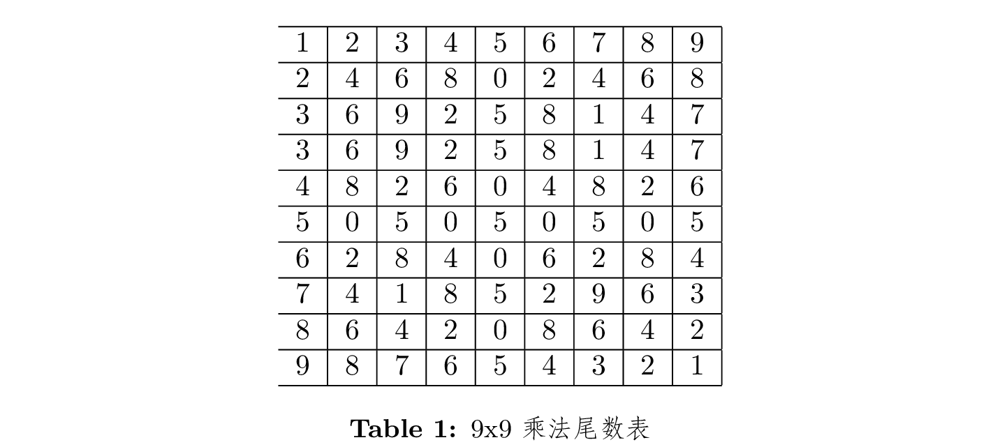

- 立方体6面(F), 8角(V), 12棱(E)

  - $F = 2E/4$, $F:E = 1:2$, $V = 2E/3$, $V:E = 2:3$, $F = 3V/4$, $F:V=3:4$

## 12 补充

### 12.1 对勾✅函数

$$ f(x) = bx + \frac{a}{x} (a>0, b>0)$$

$$ \min f(x) = 2\sqrt{ab}, \text{when } x = \sqrt{\frac{a}{b}} $$

when $b = 1$,

$$ \min f(x) = \min (x + \frac{a}{x}) = 2 \sqrt{a}, \text{when } x = \sqrt{a} $$

### 12.2 复利近似估算

$$\begin{align*}
    (1 + x) ^ n &= C^{0}_{n} + C^{1}_{n} x + C^{2}_{2} x^2 + O(n^3) \\
                &> 1 + nx + \frac{n(n-1)}{2} x^2 \\
                &> 1 + nx
   \end{align*}$$

When $x$ is small,

$(1+x)^2 \approx 1 + 2x$

$(1+x)^3 \approx 1+3x+3x^2$

$(1+x)^4 \approx 1 + 4x + 6x^2$

[//]: # (vim: tw=78:ts=8:sts=2:sw=2:ft=markdown:norl:)

