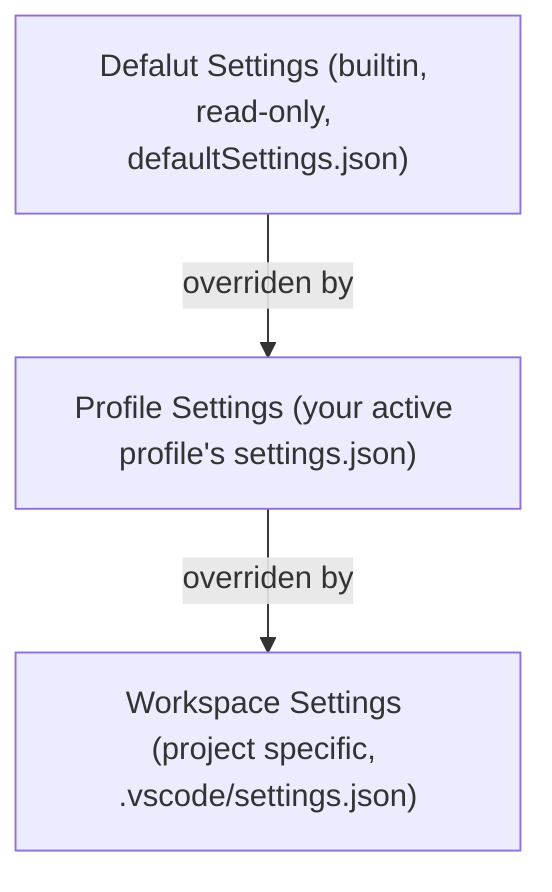

## Shortcut keys

- Open commands: `<Command>+<Shift>+p`

## Settings

### Three tier settings



#### Default settings

- Read-only
- View via `Preferences: Open Default Settings (JSON)`
- Merged from
  - VS Code core defaults
  - Every installed extension's declared defaults (`package.json`)

Each extension ships with a package.json that declares its contributed
settings and their default values. When the extension is activated, VS Code
merges those into the live default settings layer.

For example, in the `defaultSettings.json`, you can see below settings injected
by Pylance extension.

```json
"python.analysis.typeCheckingMode": "off"  // Pylance's default
```

#### Profile settings

- Synced to GitHub account
- Open via `Preferences: Open User Settings (JSON)`

For example, to turn on type checking of Pylance, override the settings in
user profile `settings.json`.

```json
{
    "python.analysis.typeCheckingMode": "standard",
}
```

#### Workspace settings and workspace-only settings

- Open via `Preferences: Open Workspace Settings (JSON)`
- `.vscode/settings.json`
- Project specific settings:
  - `.vscode/extensions.json`: recommends extensions relevant to this
  project's language and tooling.
  - `.vscode/launch.json`: defines how to run and debug this specific
  application — its entry points, arguments, environment variables.
  - `.vscode/tasks.json`: defines build/run/test tasks for this project — its
  Makefile targets, test commands, etc.

