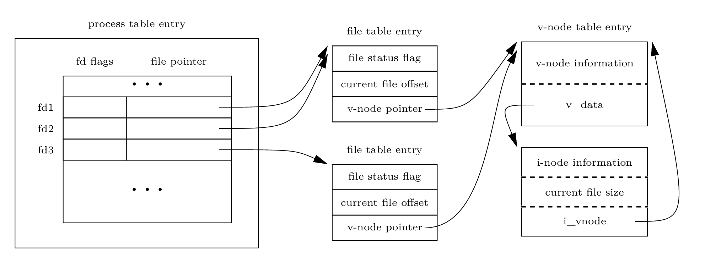

## Introduction

- 5 unbuffered I/O functions
  - `open`, `read`, `write`, `lseek`, `close`
  - Unbuffered means each `read` or `write` invokes a system call in the
    kernel. They are not part of ISO C, but are part of POSIX.1 and the SUS.
- Topics on sharing resources among mulitple processes
  - Atomic operation about file I/O and the arguments to the `open` function.
  - How files are shared among multi-processes and which kernel structures are
    invoked.
  - `dup`, `fcntl`, `sync`, `fsync`, `ioctl`

## File Descriptors

- To the kernel, all open files are referred to by file descriptors.
- Non-negative integer
- By convention, UNIX System shells associate fd 0 with the stdin of a
  process, fd 1 with the stdout of a process, fd 2 with stderr.
- `STDIN_FILENO`, `STDOUT_FILENO`, `STDERR_FILENO`, defined in `<unistd.h>`
- range from 0 to `OPENMAX - 1` (for macOS, the limit is 256 ~ 10240)

## open and openat Functions

```c
#include <fcntl.h>
int open(const char *path, int oflag, ... /* mode_t mode */ );
int openat(int fd, const char *path, int oflag, ... /* mode_t mode */ );
// Return: file descriptor if OK, -1 on error
```

- oflag, formed by ORing one or more of the following constants
  - required: exactly one of the five constants:
    - `O_RDONLY`, `O_WRONLY`, `O_RDWR`, `O_EXEC`, `O_SEARCH`
  - optional:
    - `O_APPEND`, `O_CLOEXEC`, `O_CREAT`, `O_DIRECTORY`, `O_EXCL`, `O_NOTTY`
      `O_NOFOLLOW`, `O_NOBLOCK`, `O_SYNC`, `O_TRUNC`, `O_TTY_INIT`,
      `O_DSYNC`, `O_RSYNC`

- The fd returned by `open` and `openat` is guaranteed to be the
  lowest-numbered unused descriptor.
- `openat` == `open` except the `path` parameter specifies a relative path
  and the `fd` parameter != `AT_FDCWD` (start at the current working
  directory). In this case the file to be opened is determined relative to the
  directory associated with the `fd` instead of the `cwd`.
- `openat` to address two problems:
      - give threads a way to use relative pathnames to open files in directories
        other than `cwd`. (Since all threads in the same process share the same
    `cwd`)
  - avoid `TOCTTOU` (time-of-check-to-time-of-use) errors
    - vulnerability in-between two non-atomic calls, the file can be changed
    between "check()" and "use()", thereby invalidating the results of the
    first call (check()), leading to an error or opening up a security hole.
- filename and pathname truncation
  BSD-derived(including macOS) and Linux always return an error `ENAMETOOLONG`
  if `_POSIX_NO_TRUNC` is in effect (otherwise silently truncated). Modern
  file systems support a maximum(`NAME_MAX`) of 255 chars for filename and
  a maximum(`PATH_MAX`) of 1024 chars for pathname.

## creat Function (obsoleted by open(2))

This is equivalent to

```c
open(path, O_WRONLY | O_CREAT | O_TRUNC, mode);
```

Before `open(2)` was provided, if we were creating a temporary file that we
want to write and then read back, we had to `creat`, `close`, `open`. Now just

```c
open(path, O_RDWR | O_CREAT | O_TRUNC, mode);
```

## close Function

```c
#include <unistd.h>
int close(int fd);      // Returns: 0 if OK, -1 on error
```

Closing a file also releases any record locks that the process may have on the
file. When a process terminates, all of its open files are closed
automatically by the kernel.

## lseek Function

Every open file has an associated  "current file offset", normally $\ge 0$,
which measures the number of bytes from the beginning of the file. Read and
write operations start at the offset and cause the offset to be incremented by
the number of bytes read or written. By default, the offset is initialized to
0 when a file is opened, unless the `O_APPEND` option is specified.

An open file's offset can be set explicitly by call `lseek`.

```c
#include <unistd.h>
off_t lseek(int fd, off_t offset, int whence);  // Returns: new file offset if
                                                // OK, -1 on error
```

The interpretation of the `offset` depends on the `whence` argument:

- `SEEK_SET`, set to `offset` bytes from the beginning, i.e., $offset + 0$
- `SEEK_CUR`, set to $offset + cur$
- `SEEK_END`, set to $offset + end$, `end` i.e., the size of the file

`offset` can be negative, and the current offset can also be negative for
certain devices, but for regular files the current offset must be
non-negative.

```c
off_t currpos;
currpos = lseek(fd, 0, SEEK_CUR);
```

Seeking zero bytes from the current position can be used to determine:

- the current offset
- if a file is capable of seeking. If `fd` refers to a pipe, FIFO, or socket,
  `lseek` sets `errno` to `ESPIPE` and returns -1.

A file's current offset can be greater than the file's current size, in which
case the next write to the file will extend the file. (so called "create a
**hole** in a file"). Any bytes in the hole, i.e. have not been written, are
read back as **0**.

A hole in a file isn't required to have storage backing it on disk. Depending
on the file system implementation, when you write after seeking past the end
of a file, new disk blocks might be allocated to store the data, but there is
no need to allocate blocks for the data between the old end of file and the
location where you start writing.

- Use `od` to dump a file containing holes. See [utils.md](./utils.md#od---octal-decimal-hex-ascii-dump)

```sh
od -c file.hole
```

- Use `ls -ls` to show file size in disk blocks. If sparse file is supported
  by your file system, a file with holes should be less in blocks than the
  one of the same file size without holes. But on my macOS, they are the same
  in blocks.
- Use `getconf` to retrieve standard configuration variables

```sh
getconf -v POSIX_V6_LP64_OFF64 FILESIZEBITS ./aaa
56
```

## read Function

The read operation starts at the file's current offset. Before a successful
return, the offset is incremented by the number of bytes actually read.

```c
#include <unistd.h>
ssize_t read(int fd, void *buf, size_t nbytes);
// Returns: number of bytes read, 0 if end of file, -1 on error
```

`ssize_t` signed, `size_t` unsigned

## write Function

The write operation starts at the file's current offset. If the `O_APPEND`
option was specified when the file was opened, the file's offset is set to
the current end of file before write. After a successful write, the file's
offset is incremented by the number of bytes actually written.

```c
ssize_t write(int fd, const void *buf, size_t nbytes);
// Returns: number of bytes written if OK, -1 on error
```

## I/O Efficiency

```c
// read from standard input and writes to standard output

...
#define BUFFSIZE 4096
...
while ((n = read(STDIN_FILENO, buf, BUFFSIZE)) > 0)
    if (write(STDOUT_FILENO, buf, n) != n)
        err_sys("write error");

...
```

Run the above program to copy file content by exploiting UNIX system shell's
I/O redirection. The program doesn't have to open the input and output files.

The program also doesn't need to close the input file or output file, cause
the UNIX kernel will close all open file descriptors in a process when the
process terminates.

```sh
# copy infile's content to outfile
./a.out < infile > outfile
```

CPU time profiling tests show that 4K buffer is a good choice. (Linux ext4
file system with 4096-byte blocks.

### core dump

When programs read and write files, the operating system will try to cache the
file ***incore***, ***incore*** means ***in main memory***. Back in the day, a
computer's main memory was built out of ferrite core.

`read-ahead` to improve performance.

## File Sharing

The kernel uses 3 data structures to represent an open file, and the
relationships among them determine the effect one process has on another
process with regard to file sharing.

1. Every process has an entry in its process table. This entry is a vector of
   open file descriptors, with one entry per descriptor.

   A file descriptor entry contains:

   - file descriptor flags
   - a pointer to a file table entry

2. The kernel maintains a file table for all open files.

   Each file table entry contains:

   - file status flags, such as read, write, append, sync and non-blocking
   - current file offset
   - a pointer to the v-node table entry for the file

3. Each open file (or device) has a v-node structure that contains information
   about the type of file and pointers to functions that operate on the file.
   For most files, the v-node contains the i-node for the file. This info is
   read from disk when the file is opened.

   A i-node contains the owner, the size, pointers to where the actual data
   blocks are located on disk, and so on.


**NOTE**

- Linux has no v-node, a generic i-node is used.
- The table of open descriptors can be stored in user area (a separate process
  structure that can be paged out) instead of the process table.

The v-node was invented to provide support for multiple file system types on a
single computer system, done independently by Bell Labs and Sun MS. Sun called
it **Virtual File System(VFS)** .

Two independent processes with the same file open


Each process has its own file table entry for the same open file, but only a
single v-node table entry for a given file.

- After each write, the current file offset(CFO) in the file table entry is
  incremented by the number of bytes written. If the current file offset
  exceeds the current file size, the current file size in the i-node table
  entry is set to the current file offset.
- If a file is opened with the `O_APPEND` flag, a corresponding flag is set in
  the file status flags of the file table entry. Each time a `write` is
  performed for a file with this append flag set, the CFO in the file table
  entry is first set to the current file size from the i-node table entry.
  This forces every `write` to be appended to the curren end of file.

  ***NOTE*** `open` with `O_APPEND` only set file status flags but not the
  CFO in the file table entry.

- `lseek` set and return the CFO in the file table entry. No I/O takes place.
  When `lseek` sets `SEEK_END`, the CFO is set to the current file size from
  the i-node table entry.

Multiple file descriptor entries can point to the same file table entry.

- dup(2)
- after a fork(2), the parent and the child share the same file table entry
  for each open file descriptor.

Differences between file descriptor flags (fdf) and file status flags (fsf).

- fdf: apply only to a single descriptor in a single process
- fsf: apply to all descriptors in any process that point to the file table
  entry.

## Atomic Operations

Any operation that requires more than one function call cannot be atomic.

Take appending to a file as an example, in older versions of the UNIX System,
without O_APPEND support, two calls lseek(2) and write(2) were needed, which
is not atomic.

Now, as described above, write(2) is atomic for it positions the file to its
current end of file before each write, if the file is opened with O_APPEND.
pread(2) / pwrite(2) (seek to offset and I/O) and dup2(2) (close(2) and
fcntl(fd, F_DUPFD, fd2)) are all atomic functions.

### `pread` and `pwrite` Functions

```c
#include <unistd.h>

ssize_t pread(int fd, void *buf, size_t nbytes, off_t offset);
                    Returns: num of bytes read, 0 if end of file, -1 on error
ssize_t pwrite(int fd, const void *buf, size_t nbytes, off_t offset);
                    Returns: num of bytes written if OK, -1 on error
```

pread(2)/pwrite(2) is equivalent to calling lseek(2) and read(2)/write(2)
except that

- No way to interrupt the two operations (Atmoic).
- The current file offset keeps unchanged, the same position as before
  pread(2)/pwrite(2) is called.

### Creating a File

```c
if (fd = open(path, O_CREAT|O_EXCL)) < 0) {
    ...
}
```

Atomic operation refers to an operation that might be composed of multiple
steps. Either all the steps are performed (on success) or none are performed
(on failure).

In this case, open(2), when called with both flags, performs file existence
check and file creation atomically.

## dup and dup2 Functions

```c
#include <unistd.h>

int dup(int fd);
int dup2(int fd, int fd2);
                        Both return: new file descriptor if OK, -1 on error
```

.png)

`dup(fd);` is equivalent to `fcntl(fd, F_DUPFD, 0);`

Similarly, `dup2(fd, fd2);` is equivalent to
`close(fd2); fnctl(fd, F_DUPFD, fd2);`, but not exactly, cause:

1. dup2(2) is an atomic operation, whereas the alternate form involves two
   calls. It is possible to modify the file descriptors between the close(2)
   and fnctl(2)

2. There are some `errno` differences between dup2(2) and fcntl(2)

## sync, fsync, and fdatasync Functions

These functions ensure consistency of the file system on disk with the
contents of the buffer cache or the page cache. Make the ***delayed-write***
finally write from the kernel to disk.

```c
#include <unistd.h>
int fsync(int fd);
int fdatasync(int fd);
                        Returns: 0 if OK, -1 on error
void sync(void);
```

sync(2) simply queues all the modified block buffers for writing and returns;
it doesn't wait for the disk writes to take place. It is normally called
periodically (usually every 30 seconds) from a system daemon called update(8).

sync(1) or sync(8) command calls the sync(2) function.

fsync(2) refers only to a single file and waits for the disk writes to
complete before returning. Used when an application, such as a database, needs
to be sure that the modified blocks have been written to the disk.

fdatasync(2), similar to fsync(2), affects only the data portions of a file.

FreeBSD 8.0 doesn't support fdatasync(2), neither does macOS 12.7.

## fcntl Function

The `fcntl` function can change the properties of a file already open.

```c
#include <fcntl.h>
int fcntl(int fd, int cmd, ... /* int arg */ );
                    Returns: depends on cmd if OK(see following), -1 on error
```

Five purposes:

1. Duplicate an existing descriptor (`F_DUPFD` or `F_DUPFD_CLOEXEC`)
2. Get/set file descriptor flags (`F_GETFD` or `F_SETFD`)
3. Get/set file status flags (`F_GETFL` or `F_SETFL`)
4. Get/set asynchronous I/O ownership (`F_GETOWN` or `F_SETOWN`)
5. Get/set record locks (`F_GETLK`, `F_SETLK`, or `F_SETLKW`)

Commands:

`F_DUPFD`   New fd is the lowest-numbered that is not already open, and
            greater than or equal to the 3rd argument (an integer). It
            shares the same file table entry as fd, but has its own set
            of file descriptor flags in which `FD_CLOEXEC` is cleared.

`F_DUPFD_CLOEXEC` Same as `F_DUPFD` except set the `FD_CLOEXEC` flag
                  associated with the new file descriptor.

`F_GETFD`
`F_SETFD`   Return or set the file descriptor flags. Currently only
            `FD_CLOEXEC` is defined.
            1 (do close-on-exec), 0 (don't close-on-exec)

`F_GETFL`   Returns the file status flags for the fd. The five access-mode
            are mutually exclusive. `O_ACCMOD` mask must be used to obtain
            the access-mode bits and then compare the result against the
            five values.

`F_SETFL`   Only set the last seven flags.

`F_GETOWN`  Get the process ID or process group ID currently receiving the
            `SIGIO` and `SIGURG` signals.

`F_SETOWN`  Set the process ID or process group ID to receive the `SIGIO`
            and `SIGURG` signals. See asynchronous I/O signals.[AIO](./aio.md)


Ex.

```sh
$ ./a.out 0 < /dev/tty
read only
$ ./a.out 1 > temp.foo
$ cat temp.foo
write only
$ ./a.out 1 >> temp.foo
$ cat temp.foo
write only
write only, append
$ ./a.out 2 2>> temp.foo
write only, append
$ ./a.out 5 5<> temp.foo
read write
```

Ex. set file status flags

```c
void set_fl(int fd, int flags)
{
    val = fcntl(fd, F_GETFL, 0);
    val |= flags;       /* turn on flags */
    fcntl(fd, F_SETFL, val)
}

void clr_fl(int fd, int flags)
{
    val = fcntl(fd, F_GETFL, 0);
    val &= ~flags;       /* turn off flags */
    fcntl(fd, F_SETFL, val)
}
```

Ex. set `O_SYNC` flag and do copy file from in to out (Env. macOS 12.7)

```c
set_fl(STDOUT_FILENO, O_SYNC)
```

With `O_SYNC` cleared,

```sh
mkfile 512m 512m
./test_read_write < 512m > 512m.new  0.07s user 1.33s system 83% cpu 1.692 total
```

With `O_SYNC` set, wait write to disk

```sh
mkfile 512m 512m
time ./test_read_write < 512m > 512m.new
./test_read_write < 512m > 512m.new  0.09s user 3.43s system 57% cpu 6.133 total
```

## ioctl Function

The `ioctl` is for miscellaneous device I/O operations. Terminal I/O **was**
the biggest user.

```c
#include <unistd.h>     /* System V */
#include <sys/ioctl.h>  /* BSD and Linux */

int ioctl(int fd, int request, ...);
                            Returns: -1 on error, something else if OK

int ioctl(int fd, unsigned long request, ...); /* FreeBSD 8.0 and macOS */
```

Additional device-specific headers are required. E.g. `<termios.h>`

Each device driver can define its own set of ioctl commands. The system,
however, provides generic ioctl(2) commands for different classes of devices.


## /dev/fd

New systems provide a directory `/dev/fd` whose entries are files named 0, 1,
2, and so on. Opening the file `/dev/fd/n` is equivalent to duplicating
descriptor n, **assuming that descriptor n is open.** ("BAD descriptor" error
will be reported if `n` doesn't exist.)

```c
fd = open("/dev/fd/0", mode);
/* is equivalent to */
fd = dup(0);
```

Most systems ignore the specified mode, whereas others require that it be a
subset of the mode used when the referenced file was originally opened (E.g.
macOS).

The Linux implementation of `/dev/fd` is an exception. It maps file descriptors
into symbolic links pointing to the underlying physical file. When you open a
`/dev/fd/n`, you are really opening the file associated with real file. Thus the
mode of the new descriptor is unrelated to the mode of the `/dev/fd/n`.

```sh
/dev/stdin -> /dev/fd/0
/dev/stdout -> /dev/fd/1
/dev/stderr -> /dev/fd/2
```

```sh
filter file2 | cat file1 - file2 | lpr
```

is equivalent to

```sh
filter file2 | cat file1 /dev/fd/0 file2 | lpr
```

## Exercises

Q3.1 When reading or writing a disk file, are the function described in this
chapter really unbuffered?

A: No. Performance of read or write operations on a file opened with O_SYNC is
much slower than that on the same file opened without O_SYNC shows that the
system calls in the kernel has buffer or cache. It takes more time for every
operation waiting for the underlying disk read or write finish.

When we say ***unbuffered***, we mean "unbuffered in userspace" (to minimize
the system call overhead). The data read/written here will go through the
kernel's buffer cache.

See [Ex3_1_read_and_write.c](./src/Ex3_1_read_write.c)

Q3.2 Write your own `dup2(2)`, don't use `fcntl`. Be sure to handle errors.

A: Both solutions (recursive & non-recursive) are limited to OPEN_MAX, which
is 256 on macOS 12.7 64-bit

Solution 1: use recursive call's kernel stack.
```c
int recur(int fd, int newfd) {
  /* error path */
  if (fd == -1)
    return -1;

  /* OK path */
  if (fd == newfd)
    return fd;

  int ret = recur(dup(fd), newfd);
  if (close(fd) == -1)
    return -1;
  return ret;
}

int mydup2(int fd, int newfd) {
  /* test if fd is an active, valid file descriptor */
  /*
  char path[128];
  snprintf(path, 128, "/dev/fd/%d", fd);
  if (open(path, O_RDONLY) < 0) {
  */
  int tmpfd = dup(fd);
  if (tmpfd < 0) {
    errno = EBADF;
    return -1;
  }
  if (close(tmpfd) == -1)
    return -1;

  /* test if newfd is a non-negative and not greater than the maximum */
  // allowable number
  long fmax = open_max();
  if ((long)newfd < 0 || (long)newfd > fmax) {
    errno = EBADF;
    return -1;
  }

  /* test if no need to dup */
  if (newfd == fd)
    return fd;

  /* close newfd after all tests pass, ignore inactive newfd */
  if (close(newfd) == -1 && errno != EBADF)
    return -1;

  return recur(dup(fd), newfd);
}
```

Solution 2: use user stack

```c
int rstack[10240];
int *sp;
#define push(sp, n) (*((sp)++)) = (n)
#define pop(sp) (*--(sp))

int mydup2(int fd, int newfd) {
  /* test if fd is an active, valid file descriptor */
  /*
  char path[128];
  snprintf(path, 128, "/dev/fd/%d", fd);
  if (open(path, O_RDONLY) < 0) {
  */
  int tmpfd = dup(fd);
  if (tmpfd < 0) {
    errno = EBADF;
    return -1;
  }
  if (close(tmpfd) == -1)
    return -1;

  /* test if newfd is a non-negative and not greater than the maximum */
  // allowable number
  long fmax = open_max();
  if ((long)newfd < 0 || (long)newfd > fmax) {
    errno = EBADF;
    return -1;
  }

  /* test if no need to dup */
  if (newfd == fd)
    return fd;

  /* close newfd after all tests pass, ignore inactive newfd */
  if (close(newfd) == -1 && errno != EBADF)
    return -1;

  /* Use stack to save dup2(2)ed fds for later close(2) */
  tmpfd = fd;
  sp = rstack;
  while((tmpfd = dup(tmpfd)) != newfd) {
    if (tmpfd == -1)
      return -1;
    push(sp, tmpfd);
  }
  while(sp > rstack) {
    int fd = pop(sp);
    /* printf("sp=%d, fd=%d\n", (int)(sp-rstack), fd); */
    if (close(fd) != 0)
      return -1;
  }
  return tmpfd;
}
```


Q3.3 Which fds are affected by an fcntl(2) on fd1 with a command of F_SETFD?
Which fds are affected by an fcntl(2) on fd1 with a command of F_SETFL?

A: With F_SETFD, only fd1 is affected. With F_SETFL, both fd1 and fd2 are
affected.



Q3.4 The following sequence of code has been observed in various programs:

```c
dup2(fd, 0);
dup2(fd, 1);
dup2(fd, 2);
if(fd > 2)
    close(fd);
```

A: If fd is 1, after the execution of the above sequence of code, the three
file descriptor 0, 1, 2 point to the same file table entry that the fd 1 has
been pointing to. If fd is 3, after the execution, all three descriptors point
to the file table entry that the fd 3 once pointed before the fd 3 is removed.
The `if` check makes sure that the first three file descriptors are all active
and point to the same file table entry.

Q3.5 The Bourne shell, Bash, Ksh notation

```sh
digit1>&digit2
```

says to redirect descriptor digit1 to the same file as descriptor digit2. What
is the difference between the two commands shown below?

```sh
./a.out > outfile 2>&1
./a.out 2>&1 > outfile
```

A: 1st command, it says the standard output of ./a.out is redirected to
outfile, and the standard error of ./a.out is also redirected to outfile.
2nd command, it says the standard error of ./a.out is redirected to its
standard output, and the standard output is redirected to outfile.
Concisely speaking,
1st command:

```c
fd = open("outfile", O_WRONLY);
dup2(fd, 1);
dup2(1, 2);  /* dup2(fd, 2);*/
```

2nd command:

```c
dup(1, 2);
fd = open("outfile", O_WRONLY);
dup2(fd, 1);
```

Q3.6 If you open a file for read-write with the append flag (O_RDWR|O_APPEND),
can you still read from anywhere in the file using lseek? Can you use lseek to
replace existing data in the file? Write a program to verify this.

A: random read, yes. random write, no.
O_APPEND flags only affects write.
For each read, it returns the number of bytes read from the current offset,
and move the offset forward that number of bytes.
For each write, it will firstly set the current file offset to the value of
the current file size retrieved from the i-node table entry. This will force
every write to be appended to the current end of file. After write, the number
of bytes written will be added to the current file size in the i-node
information.

```c
#include "apue.h"
#include <assert.h>
#include <string.h>
#include <fcntl.h>

int main(void)
{
  char *path = "tmp/fileio/3_6.dat";
  int fd = -1;
  if ((fd = open(path, O_RDWR|O_APPEND)) == -1) {
    err_sys("open file [%s] failed.", path);
  }
  assert(0 == lseek(fd, 0, SEEK_CUR));  /* initial current file offset */
  assert(30 == lseek(fd, 0, SEEK_END)); /* initial file size */
  lseek(fd, 5, SEEK_SET); /* set the offset to 5 */
  char rbuf[128];
  assert(5 == read(fd, rbuf, 5)); /* read 5 bytes, move offset forward by 5 */
  assert(0 == strcmp("56789", rbuf));
  assert(15 == lseek(fd, 5, SEEK_CUR)); /* move forward by another 5, to 15 */
  char *wbuf = "hello";
  assert(5 == write(fd, wbuf, strlen(wbuf))); /* write wbuf to file, 5 chars */
  assert(35 == lseek(fd, 0, SEEK_CUR)); /* current file offset is 35, not 20 */
  assert(35 == lseek(fd, 0, SEEK_END)); /* current file size is 35, not 30 */
  return 0;
}
```

## Summary


