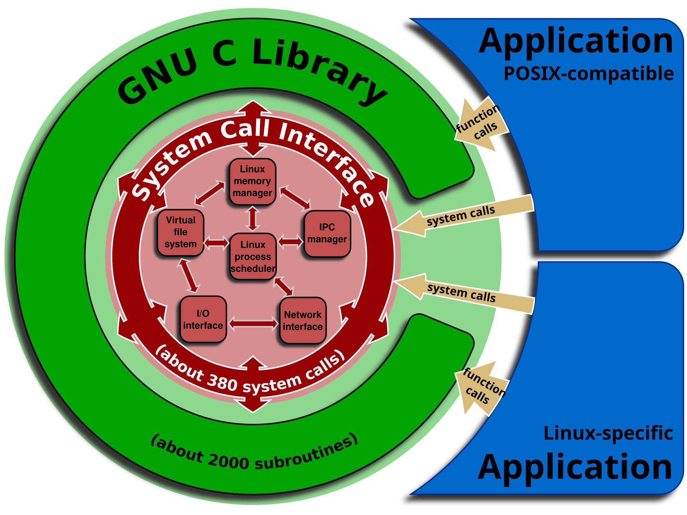

## System Calls and Library Functions

### system calls

- entry points directly into the system kernel
- documented in Section 2 of the UNIX Programmer's Manual (e.g. `man 2 write`)
- defined in the C language, each one has a function in the Standard C Library
  - arguments transferred and placed in registers (like rdi, rsi, rdx, etc.)
  - execute a machine instruction, like `syscall` on x86_64, which triggers a
    software interrupt (trap) that switches from user mode to kernel mode (by
    generating an exception that transfers control to a predefined address
    in the kernel - the syscall entry point).
    - on x86_64, it switches the CPU from user mode (ring 3) to kernel mode (
    ring 0), ensuring the kernel can safely perform sensitive operations (like
    accessing hardware, managing processes).
  - the CPU performs a context switch, saving the state of the user-space
    process (registers, program counter, etc.) and loading the sate of the
    kernel execution context.
  - the OS handles the system call in kernel mode
  - once the system call is complete, control is switched back to user-space
    by calling another machine instruction, like `sysret` on x86_64, user
    program continues execution where it left off.

### library functions

- application interfaces
- documented in Section 3 of the UNIX Programmer's Manual (e.g. `man 3 printf1)
- some functions has nothing to do with system call, like `atoi(3)`, `man 3
  atoi`
- some functions involves system calls, like `printf(3)` using `write(2)` or
  `malloc(3)` using `sbrk(2)`
  - `man 3 printf`, `man 2 write`, `man 3 malloc`, `man 2 sbrk`

