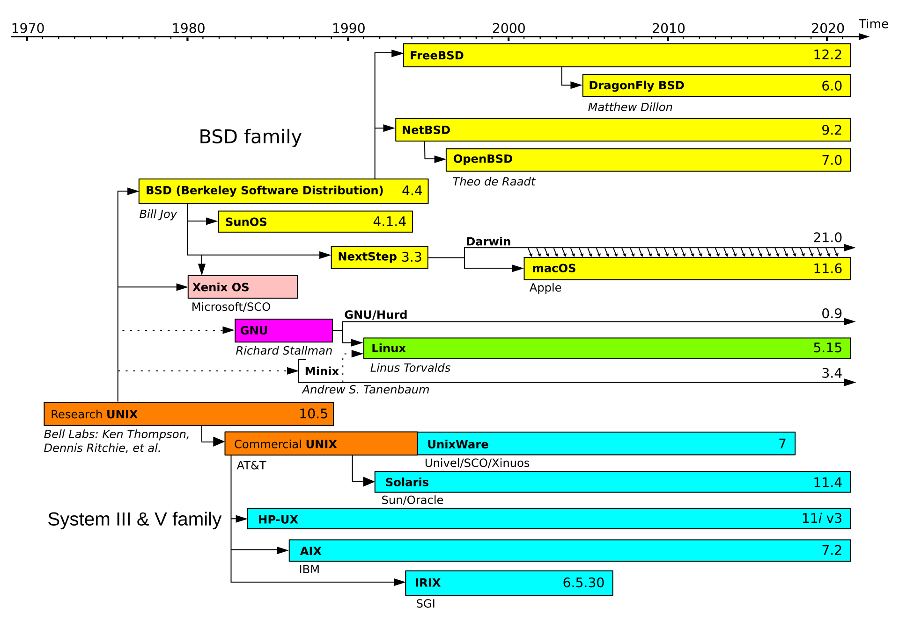

## IEEE POSIX 1003.1

**POSIX (portable operating system interface)**


NOTE: shell and utilities (1003.2)

### ISO C Standard


***NOTE***

On macOS, the headers are under

```sh
/Library/Developer/CommandLineTools/SDKs/MacOSX.sdk/usr/include/
```

### The Single Unix Specification(SUS)

A superset of POSIX.1, specifies additional interfaces. POSIX.1 can be seen as
the Base Specifications portion of the SUS. POSIX.1-2008 as Issue 7 of the
Base Specifications in SUSv4(2010).

- Base Definitions
- System Interfaces
- Shell and Utilities
- Rationale

### POSIX Required Headers


### POSIX Optional Headers

X/Open System interfaces(XSI) option

- describes optional interfaces of POSIX.1
- defines which optional portions of POSIX.1 must be supported for an
   implementation to be deemed **XSI conforming**. Only XSI-conforming
   implementations can be called **UNIX** systems.


See `<unistd.h>`

### UNIX System Implementations

#### UNIX Time-Sharing System on PDP-11 (V7, 1979), 3 branches

- System V (commercial version, SVR4 final version), AT&T
- 4.xBSD, UC Berkeley (4.4BSD final version)
- V10 (1990, research version, final version), AT&T Bell Laboratories Computing Science Research Center

#### FreeBSD (4.4BSD-Lite based)

#### Linux (to replace MINIX)

#### Mac OS X(Darwin)

Darwin, is based on a combination of Mach kernel, the FreeBSD, an OO framework
for drivers and other kernel extensions.



#### Solaris(SVR4 based, by Sun Microsystems, now Oracle)

#### Other UNIX systems

- AIX, IBM
- HP-UX, HP
- IRIX, Silicon Graphics
- UnixWare, based on SVR4, SCO

### Limits

Magic numbers and constants defined by implementations, two types:

- Compile-time limits (e.g., what’s the largest value of a short integer?)
  - defined in headers, included at compile time
- Runtime limits (e.g., how many bytes in a filename?)
  - require to call a function to obtain the limit's value during runtime,
  conf functions like sysconf, pathconf, fpathconf

#### ISO C Limits


Similarly, sizes of float values are defined in <float.h>.

The following limits are defined in <stdio.h>,


***NOTE***

On macOS,

```sh
/Library/Developer/CommandLineTools/SDKs/MacOSX.sdk/usr/include/
limits.h -> machine/limits.h -> i386/limits.h (C limits)
```

#### POSIX Limits

POSIX.1 defines numerous constants that deal with **implementation limits** of
the operating system.

In **APUE**, we only concern 7 categories of limits that affect the base
POSIX.1 interfaces.

1. Numerical limits: LONG_BIT, SSIZE_MAX, and WORD_BIT
2. Minimum values: the 25 constants in Figure 2.8
3. Maximum value: _POSIX_CLOCKRES_MIN
4. Runtime increasable values: CHARCLASS_NAME_MAX, COLL_WEIGHTS_MAX, LINE_MAX, NGROUPS_MAX, and RE_DUP_MAX
5. Runtime invariant values, possibly indeterminate: the 17 constants in Figure 2.9 (plus an additional four constants introduced in Section 12.2 and three constants introduced in Section 14.5)
6. Other invariant values: NL_ARGMAX, NL_MSGMAX, NL_SETMAX, and NL_TEXTMAX
7. Pathname variable values: FILESIZEBITS, LINK_MAX, MAX_CANON, MAX_INPUT, NAME_MAX, PATH_MAX, PIPE_BUF, and SYMLINK_MAX


The names without the leading `_POSIX_` were intended to be the actual values
that a given implementation supports. Some of them may not be defined in
<limits.h>, then `sysconf`, `pathconf`, `fpathconf` are used to call to get
runtime values.

***NOTE***

On macOS,

```sh
/Library/Developer/CommandLineTools/SDKs/MacOSX.sdk/usr/include/
limits.h -> sys/syslimits.h (actual implementation values w/o _POSIX_)
```

#### XSI Limits

Also about implementation limits.

1. Minimum values: the five constants in Figure 2.10
2. Runtime invariant values, possibly indeterminate: IOV_MAX and PAGE_SIZE


***NOTE***

On macOS,

```sh
/Library/Developer/CommandLineTools/SDKs/MacOSX.sdk/usr/include/
limits.h
```

#### sysconf, pathconf, fpathconf

Get runtime limits.

```c
#include <unistd.h>
long sysconf(int name);
long pathconf(const char *pathname, int name);
long fpathconf(int fd, int name);
```

The values in the 3rd column `name argument` are passed to the `name` argument
of the three conf functions.


***NOTE***

On macOS,

```sh
    /Library/Developer/CommandLineTools/SDKs/MacOSX.sdk/usr/include/
    unistd.h
```

#### Indeterminate Runtime Limits

Sometimes, some limits are not defined in `limits.h` (unavailable at compile
time) nor supported by conf functions (unavailable at runtime), these limits
are called indeterminate and needed to guess a value.

- pathnames (allocating storage for a pathname)
  - `MAXPATHLEN`(`sys/param.h`), `PATH_MAX`(`limits.h` -> `sys/syslimits.h`)
  - if not defined, call `pathconf` using the name argument `_PC_PATH_MAX`(`unistd.h`)
  - if still no results, guess a value
- maximum number of open files (determining the number of file descriptors)
  - `OPEN_MAX` (`limit.h` -> `sys/syslimits.h`)
  - if not defined, call `sysconf` using the name argument `_SC_OPEN_MAX`(`unistd.h`)
  - if still no results, guess a value

Systems that support the XSI option in the SUS will provide `setrlimit(2)`
(`sys/resource.h`), which can be used to change a value for a running process
or, changed by `limit` command in C shell, `ulimit` command in Bash, Debian,
K shell). Then, `sysconf` function shall be called every time not just the
first time.

### Options

Just as with limits, POSIX.1 defines three ways to determine options.

1. Compile time options are defined in `<unistd.h>`
2. Runtime options that are not associated with a file or a directory are
   identified with the `sysconf` function.
3. Runtime options that are associated with a file or a directory are
   discovered by calling either the `pathconf` or the `fpathconf` function.

For runtime options, see **Fig2.5**, **Fig2.18**, **Fig2.19**.

Replace `_POSIX_` with `_SC_` or `_PC_` when calling conf functions.


For each option, there're 3 possibilities for a a platform's support status.

1. If the symbolic constant is undefined or defined to have the value -1, then
the option is unspported by the platform at compile time. A runtime check may
indicate the option is supported.

2. If the symbolic constant is defined to be greater than 0, then the option
   is supported.

3. If the symbolic constant is defined to be 0, then we need to call
   `sysconf`, `pathconf`, `fpathconf` to determine. (-1, unsupported)


### Feature Test Macros

All feature test macros begin with an underscore.

`_POSIX_C_SOURCE`: All POSIX.1 headers use this constant to exclude any
implementation specific definitions.

Usages:

- Use it in `cc` command

```sh
    cc -D_POSIX_C_SOURCE=200809L file.c
```

- Set the first line of a source file to

```c
    #define _POSIX_C_SOURCE 200809L
```

`_XOPEN_SOURCE`: to enable the XSI option of SUSv4

```sh
    c99 -D_XOPEN_SOURCE=700 file.c -o file
```

To enable 1999 ISO C extensions in the gcc C compiler,  use `-std=c99` option

```sh
    gcc -D_XOPEN_SOURCE=700 -std=c99 file.c -o file
```

### Primitive System Data Types

`<sys/types.h>` defines some implementation-dependent data types, called
primitive system data types. These types end in `_t`.


### Some differences between ISO C and POSIX.1

`CLOCK_PER_SEC`

`signal` `sigaction` functions

### Exercises

#### 2.1 Avoid multiple typedefs of `size_t` among headers

```c
// <i386/_types.h>
#if defined(__SIZE_TYPE__)
typedef __SIZE_TYPE__           __darwin_size_t;        /* sizeof() */
#else
typedef unsigned long           __darwin_size_t;        /* sizeof() */
#endif

// <machine/_types.h>
#if defined (__i386__) || defined(__x86_64__)
#include "i386/_types.h"
#elif defined (__arm__) || defined (__arm64__)
#include "arm/_types.h"
#else
#error architecture not supported
#endif

// <sys/_types/_size_t.h>
#ifndef _SIZE_T
#define _SIZE_T
#include <machine/_types.h> /* __darwin_size_t */
typedef __darwin_size_t        size_t;
#endif  /* _SIZE_T */

// <stddef.h>
#include <sys/_types/_size_t.h>

// my_src.c
#include <stddef.h>

int main(void)
{
  size_t s = sizeof(int);
  return 0;
}

/* sizeof(int)=4 */
/* sizeof(long)=8 */
/* sizeof(size_t)=8 */
```

#### 2.2 Examine your system's headers

List the actual data types to implement the primitive system data types.

On macOS,

```sh
<stddef.h> -> <sys/_types.h> (<i386/_types.h>) -> <sys/types/_xxx_t.h>

clock_t         unsigned long
comp_t          unsigned short

pthread_t       <sys/_pthread/_pthread_t.h>
sig_atomic_t    int
sigset_t        unsigned int
size_t          unsigned long
ssize_t         long
time_t          long
wchar_t         int

gid_t           unsigned int
uid_t           unsigned int
pid_t           int
```

#### 2.3 Deal with sysconf returning LONG_MAX as the limit for OPEN_MAX.

Use `getrlimit()` (`<sys/resource.h>`)
