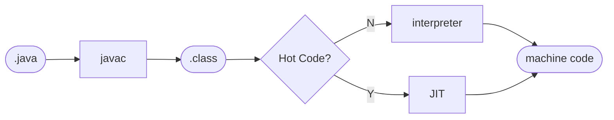

## Title

$\sqrt{100} = 10$

$10\% = 0.1$

$1M = 1024 \times 1024 = 1,048,576$

$2G = 2 \times 1024 \times 1024 \times 1024 = 2,147,483,648$

$$e = mc^2$$


```java
public class A {
  public static void main(String[] args) {
    System.out.println("Hello world!");
  }
}
```



